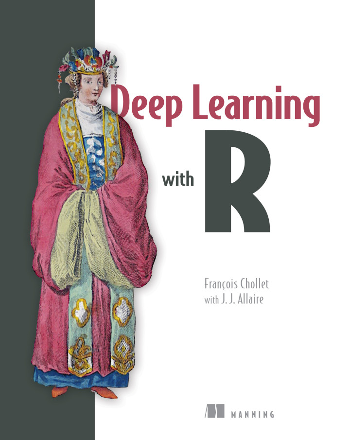
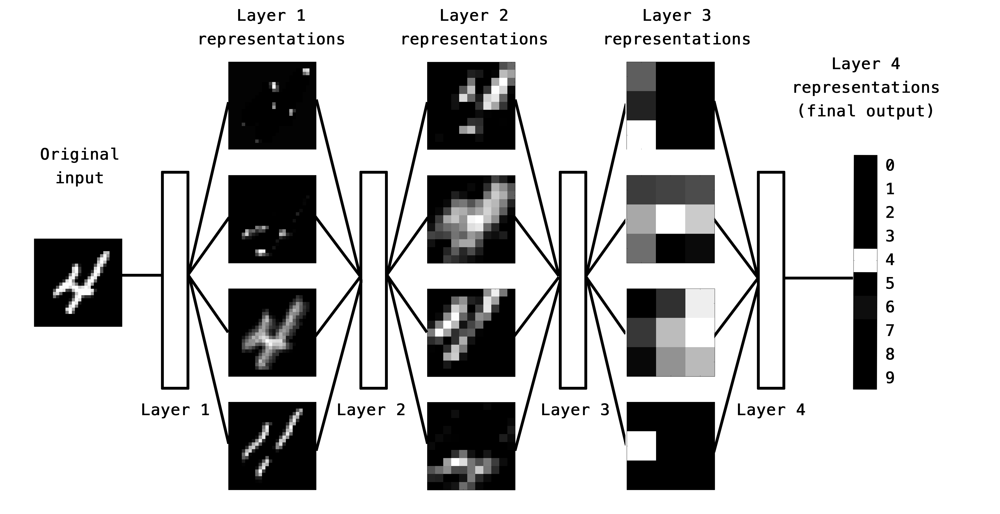
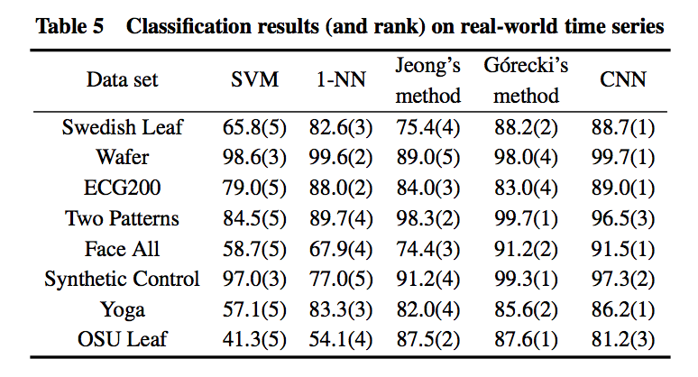
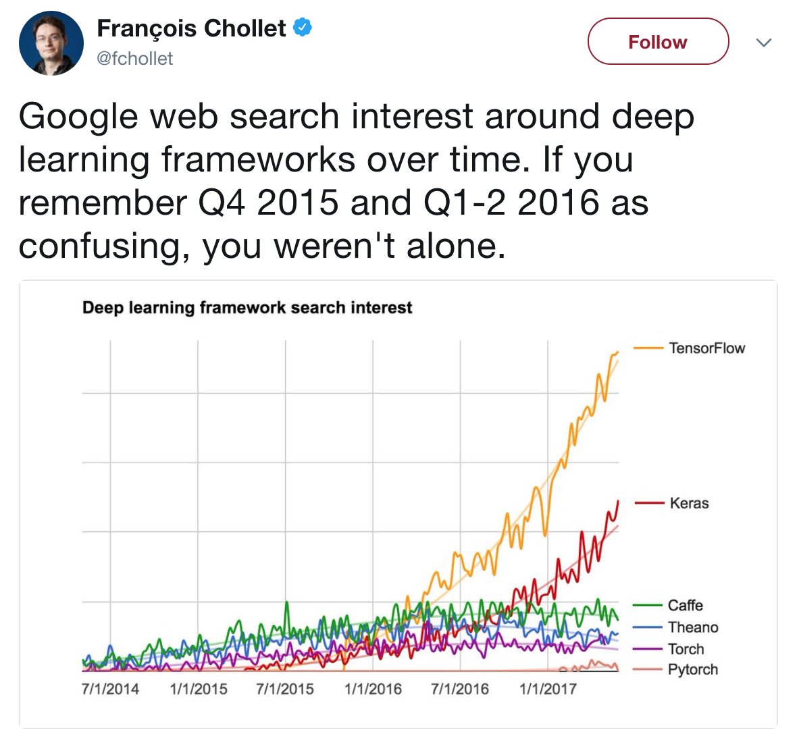
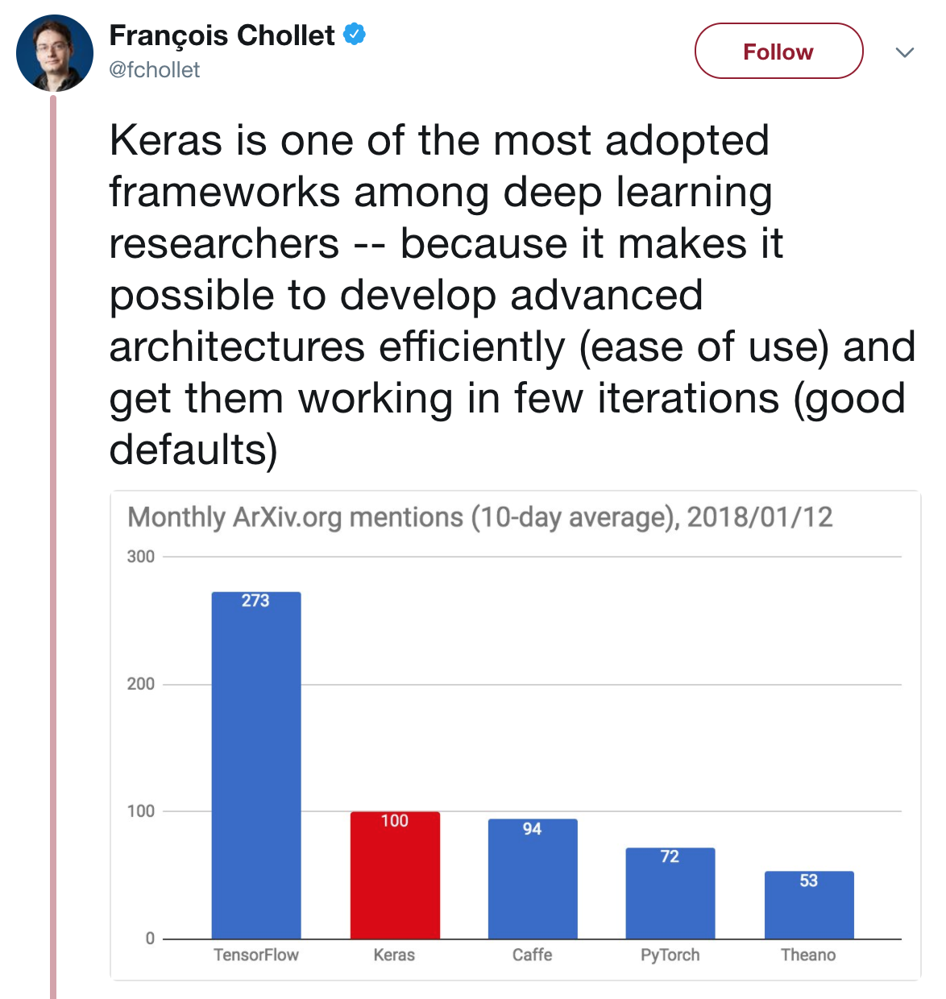
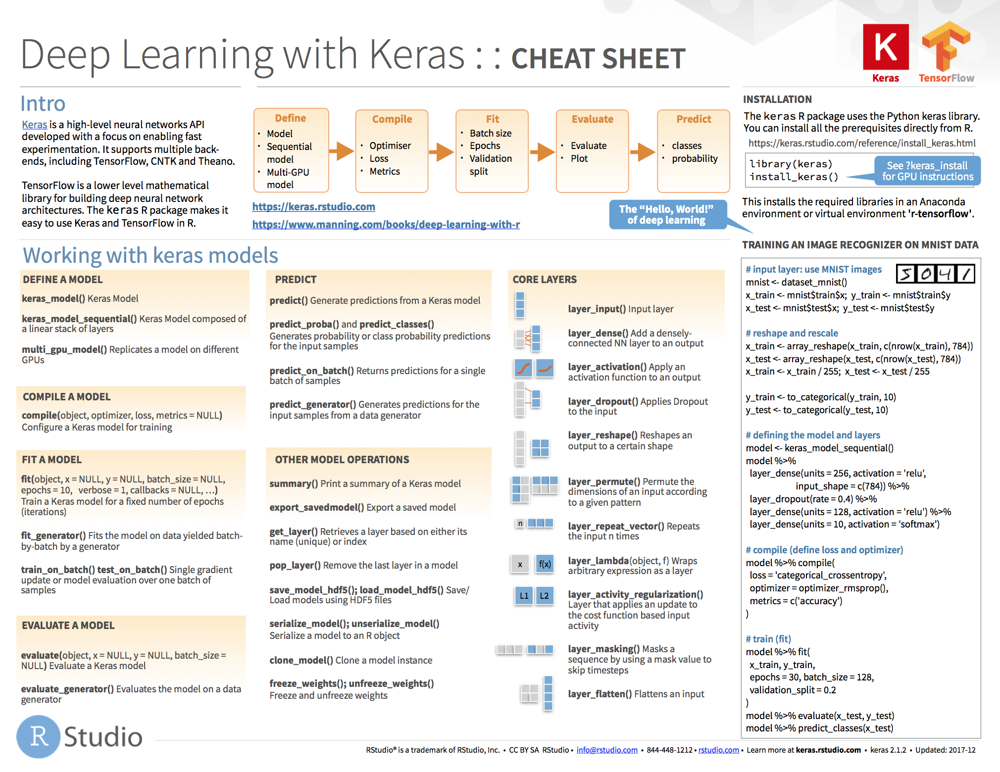

```{r setup, include=FALSE}
knitr::opts_chunk$set(eval = FALSE)
```

<style type="text/css">
.illustration {
  border: solid 1px #cccccc;
}
small {
  font-size: 0.6em;
}
h4 {
  margin-bottom: 15px; 
}
a {
  border-bottom: 0;
}
a:hover {
  color: #2a7cdf !important;
  border-bottom: 1px solid rgba(42, 124, 223, 0.5);
}
</style>

## Overview

- Deep Learning Basics

- R Interfaces to TensorFlow

- Learning More

## What is TensorFlow? | A general purpose numerical computing library

<div style="margin-top: -30px;">


-  Originally developed by researchers and engineers working on the Google Brain Team for the purposes of conducting machine learning and deep neural networks research.
- Open source software (Apache v2.0 license) 
- Hardware independent
    - CPU (via [Eigen](http://eigen.tuxfamily.org/) and [BLAS](https://en.wikipedia.org/wiki/Basic_Linear_Algebra_Subprograms))
    - GPU (via [CUDA](https://en.wikipedia.org/wiki/CUDA) and [cuDNN](https://developer.nvidia.com/cudnn))
    - TPU ([Tensor Processing Unit](https://en.wikipedia.org/wiki/Tensor_processing_unit))
- Supports [automatic differentiation](https://en.wikipedia.org/wiki/Automatic_differentiation)
- Distributed execution and large datasets
</div>

## Uses of TensorFlow | <https://tensorflow.rstudio.com/gallery/>

<div style="margin-top: -25px;">
- Image classification 
- Time series forecasting 
- Classifying peptides for cancer immunotherapy
- Credit card fraud detection using an autoencoder
- Classifying duplicate questions from Quora
- Predicting customer churn
- Learning word embeddings for Amazon reviews
</div>

<br/>

I'm confident the R community will also find novel new uses for TensorFlow...

## Deep Learning

- What is deep learning?

- What is it useful for?

- Why should R users care?

- How does it work?

- Some examples

<br/>



Special thanks to François Chollet (creator of Keras) for the concepts and figures used to explain deep learning! (all drawn from Chapter 1 of his [Deep Learning with R](https://www.manning.com/books/deep-learning-with-r) book)

## What is deep learning? | Input to output via layers of representation


## What are layers? | Data transformation functions parameterized by weights

<div style="margin-top: -10px;">
&nbsp;&nbsp;
</div>

- A layer is a geometric transformation function on the data that goes through it (transformations must be differentiable for stochastic gradient descent)

- Weights determine the data transformation behavior of a layer 


## Learning representations | Transforming input data into useful representations


The layers of representation in a deep learning model are the feature engineering for the model (i.e. feature transformations are learned rather than hard coded).

## Layers of representation | An information distillation pipeline {.smaller}


 
- Raw data goes in (in this case, grayscale images) 
- Data is transformed so that irrelevant information is filtered out (for example, the specific visual appearance of the image).
- Useful information is magnified and refined (for example, the class of the image).


## The "deep" in deep learning 

A new take on learning representations from data that puts an emphasis on learning successive layers of increasingly meaningful representations.

Other possibly more appropriate names for the field:

- Layered representations learning
- Hierarchical representations learning
- Chained geometric transformation learning

Modern deep learning often involves tens or even hundreds of successive layers of representation

Other approaches to machine learning tend to focus on learning only one or two layers of representations of the data


## What has deep learning achieved? | Complex geometric transformations, broken down into simpler ones {.smaller}


<div class="columns-2">

<div>
- Near-human-level image classification
- Near-human-level speech recognition
- Near-human-level handwriting transcription
- Improved machine translation
- Improved text-to-speech conversion
</div>

<div>
- Near-human-level autonomous driving
- Improved search results on the web
- Ability to answer natural language questions
- Superhuman Go playing
</div>

</div>

## Why should R users care about deep learning?

- New problem domains for R:
    - Computer vision
    - Computer speech recognition 
    - Reinforcement learning applications
    
- Improved techniques for our traditional domains?
    - Analyzing data with complex spatial or sequence dependencies
    - Analyzing data which requires a large amount of (potentially brittle) feature engineering to model effectively
  
Deep learning is proven to be effective at various complex "perceptual" tasks but not yet proven to be of widespread benefit in other domains.

## How do we train deep learning models?

- Basics of machine learning algorithms
- Machine learning vs. statistical modeling
- MNIST example
    - Model definition in R
    - Layers of representation
- The training loop 

A simple mechanism that, once scaled, ends up looking like magic

## MNIST layers in R

```{r}
library(keras)
model <- keras_model_sequential() %>%
  layer_conv_2d(filters = 32, kernel_size = c(3,3), activation = 'relu',
                input_shape = c(28,28,1)) %>% 
  layer_conv_2d(filters = 64, kernel_size = c(3,3), activation = 'relu') %>% 
  layer_max_pooling_2d(pool_size = c(2, 2)) %>% 
  layer_flatten() %>% 
  layer_dense(units = 128, activation = 'relu') %>% 
  layer_dense(units = 10, activation = 'softmax')
```

## MNIST layers of representation


 
## Using input data and labels to learn weights | A neural network is parameterized by its weights


## Evaluate the loss for each training batch | A loss function measures the quality of the network’s output {.smaller}


## Loss is a feedback signal used to adjust weights {.smaller}


## What is deep learning? | A simple mechanism that, once scaled, ends up looking like magic


## Geometric interpretation


Deep-learning models are mathematical machines for uncrumpling complicated manifolds of high-dimensional data.

Deep learning is turning meaning into vectors, into geometric spaces, and then incrementally learning complex geometric transformations that map one space to another.

How can we do this with simple parametric models trained with gradient descent? We just need sufficiently large parametric models trained with gradient descent on sufficiently many examples. 

## Sufficiently large parametric models | Simple grayscale digit recognizer model has > 1 million parameters {.smaller}

<div style="margin-top: -30px;">
```{r}
summary(model)
```
```
______________________________________________________________________________________
Layer (type)                          Output Shape                       Param #      
======================================================================================
conv2d_3 (Conv2D)                     (None, 26, 26, 32)                 320          
______________________________________________________________________________________
conv2d_4 (Conv2D)                     (None, 24, 24, 64)                 18496        
______________________________________________________________________________________
max_pooling2d_2 (MaxPooling2D)        (None, 12, 12, 64)                 0            
______________________________________________________________________________________
flatten_2 (Flatten)                   (None, 9216)                       0            
______________________________________________________________________________________
dense_3 (Dense)                       (None, 128)                        1179776      
______________________________________________________________________________________
dense_4 (Dense)                       (None, 10)                         1290         
======================================================================================
Total params: 1,199,882
Trainable params: 1,199,882
Non-trainable params: 0
______________________________________________________________________________________
```
</div>


## Sufficiently large for computer vision | VGG has ~ 138 million parameters, Imagenet has ~ 14 million images {.smaller}

<div style="margin-top: -30px;">
```{r}
summary(vgg16_imagenet_model)
```
```
Layer (type)                          Output Shape                       Param #      
======================================================================================
input_1 (InputLayer)                  (None, 224, 224, 3)                0            
______________________________________________________________________________________
block1_conv1 (Conv2D)                 (None, 224, 224, 64)               1792         
______________________________________________________________________________________
block1_conv2 (Conv2D)                 (None, 224, 224, 64)               36928        
______________________________________________________________________________________
block1_pool (MaxPooling2D)            (None, 112, 112, 64)               0            
______________________________________________________________________________________
... (entire model not shown) ...
______________________________________________________________________________________
fc2 (Dense)                           (None, 4096)                       16781312     
______________________________________________________________________________________
predictions (Dense)                   (None, 1000)                       4097000      
======================================================================================
Total params: 138,357,544
Trainable params: 138,357,544
Non-trainable params: 0
______________________________________________________________________________________

```
</div>

## Deep learning frontiers

- Computer vision

- Natural language processing

- Time series

- Biomedical

- What next?


## Computer vision | <https://dl.acm.org/citation.cfm?id=2999257> 

<div style="margin-top: -30px;">


- ImageNet: 3.2 million labelled images, separated into 5,247 categories, sorted into 12 subtrees like “mammal,” “vehicle,” and “furniture.”

- ImageNet Challenge: An annual competition (2010-2017) to see which algorithms could identify objects in the dataset’s images with the lowest error rate.

- Accuracy improved from 71.8% to 97.3% over the lifetime of the contest.

- Deep learning was used for the first time in 2012, and beat the field by 10.8%.

</div>

## Natural language processing | https://arxiv.org/abs/1708.02709

<div style="margin-top: -25px;">


</div>

Paper submissions could just indicate a passing fad or could be a fundamental transformation, we don't know yet!

## Language translation | https://arxiv.org/abs/1609.08144 {.smaller}

<div style="margin-top: -38px;">
Google's Neural Machine Translation System


</div>

## Time series | http://ieeexplore.ieee.org/document/7870510/ {.smaller}

<div style="margin-top: -25px;">


- Time series classification based on convolutional neural networks (same technique commonly used for images)

- Convolution and pooling operations are alternatively used to generate deep features of the raw data, which are then fed through standard dense layers.


</div>


## Time series | http://journals.plos.org/plosone/article?id=10.1371/journal.pone.0180944 {.smaller}

<div style="margin-top: -25px">


- Wavelet transforms used to address noise in financial time series. 

- Stacked autoencoder used to learn the deep features of financial time series in an unsupervised manner.

- Long Short-Term Memory (LSTM) used to retain time related information within layers for an arbitrary amount of time.
</div>

## Biomedical | https://www.biorxiv.org/content/early/2018/01/19/142760 {.smaller}

<div style="margin-top: -30px">


- Applications of deep learning to a variety of biomedical problems---patient classification, fundamental biological processes, and treatment of patients.

- While deep learning has yet to revolutionize or definitively resolve any of these problems, promising advances have been made on the prior state of the art.
</div>

## Electronic health records (EHR) | <https://arxiv.org/abs/1801.07860> 

<div style="margin-top: -40px; font-size: 0.8em;">
January 2018 study by Google, UCSF, Stanford, and U of Chicago Medicine
</div>


<div style="font-size: 0.8em;">
- Constructing predictive statistical models typically requires extraction of curated predictor variables from normalized EHR data, a labor-intensive process that discards the vast majority of information in each patient’s record.

- Deep learning approach considers entire medical record (including physicians free-text notes). The network learns representations of the key factors and interactions from the data itself.
</div>

Produced predictions for a wide range of clinical problems and outcomes that outperformed state-of-the-art traditional predictive models.


## Some problems with deep learning models

- Not easily interpreted (black box)
- Can be brittle (see "adversarial examples")
- Typically require large amounts of data to perform well
- Are often very computationally expensive to train

## Deep learning hype makes things worse | My model is deep so it must be better!

- Deep learning is experiencing unprecedented hype, and...
- The current generation of tools make deep learning accessible to many with no prior experience in statistics or modeling, however...
- It can be difficult to outperform traditional modeling techniques without a lot of effort, so...
- We will be trolled by bad deep learning models for the foreseeable future

Of course we can help here by promoting a more balanced dialog about the strengths and weaknesses of these methods.

## In spite of problems, extraordinarly useful! | We should help DL find it's appropriate place rather than dismiss it


## R interface to Tensorflow | https://tensorflow.rstudio.com

- High-level R interfaces for neural nets and traditional models

- Low-level interface to enable new applications (e.g. Greta)

- Tools to facilitate productive workflow / experiment management

- Straightforward access to GPUs for training models

- Breadth and depth of educational resources


## TensorFlow Keras API | High level API for neural networks <br/> <https://tensorflow.rstudio.com/keras/> 

```{r}
library(keras)
model <- keras_model_sequential() %>%
  layer_conv_2d(filters = 32, kernel_size = c(3,3), activation = 'relu',
                input_shape = input_shape) %>% 
  layer_conv_2d(filters = 64, kernel_size = c(3,3), activation = 'relu') %>% 
  layer_max_pooling_2d(pool_size = c(2, 2)) %>% 
  layer_dropout(rate = 0.25) %>% 
  layer_flatten() %>% 
  layer_dense(units = 128, activation = 'relu') %>% 
  layer_dropout(rate = 0.5) %>% 
  layer_dense(units = 10, activation = 'softmax')
```

## Keras adoption

<div class="columns-2">





</div>

## Keras: Data preprocessing | Transform input data into tensors {.smaller}


```{r}
library(keras)

# Load MNIST images datasets (built in to Keras)
c(c(x_train, y_train), c(x_test, y_test)) %<-% dataset_mnist()

# Flatten images and transform RGB values into [0,1] range 
x_train <- array_reshape(x_train, c(nrow(x_train), 784))
x_test <- array_reshape(x_test, c(nrow(x_test), 784))
x_train <- x_train / 255
x_test <- x_test / 255

# Convert class vectors to binary class matrices
y_train <- to_categorical(y_train, 10)
y_test <- to_categorical(y_test, 10)
```


## Keras: Model definition

```{r}
model <- keras_model_sequential()  %>% 
  layer_dense(units = 256, activation = 'relu', input_shape = c(784)) %>% 
  layer_dropout(rate = 0.4) %>% 
  layer_dense(units = 128, activation = 'relu') %>%
  layer_dropout(rate = 0.3) %>%
  layer_dense(units = 10, activation = 'softmax')

model %>% compile(
  loss = 'categorical_crossentropy',
  optimizer = optimizer_rmsprop(),
  metrics = c('accuracy')
)
```


## Keras: Model training | Feeding mini-batches of data to the model thousands of times

<div style="margin-top: -30px">
```{r}
history <- model %>% fit(
  x_train, y_train,
  batch_size = 128,
  epochs = 10,
  validation_split = 0.2
)
```
</div>

- Feed 128 samples at a time to the model (`batch_size = 128`)

- Traverse the input dataset 10 times (`epochs = 10`)

- Hold out 20% of the data for validation (`validation_split = 0.2`)


## Keras: Model training (cont.)

```{r}
plot(history)
```


## Keras: Evaluation and prediction

```{r}
model %>% evaluate(x_test, y_test)
```
```
$loss
[1] 0.1078904

$acc
[1] 0.9815
```

```{r}
model %>% predict_classes(x_test[1:100,])
```
```
  [1] 7 2 1 0 4 1 4 9 5 9 0 6 9 0 1 5 9 7 3 4 9 6 6 5 4 0 7 4 0 1 3 1 3 4 7
 [36] 2 7 1 2 1 1 7 4 2 3 5 1 2 4 4 6 3 5 5 6 0 4 1 9 5 7 8 9 3 7 4 6 4 3 0
 [71] 7 0 2 9 1 7 3 2 9 7 7 6 2 7 8 4 7 3 6 1 3 6 9 3 1 4 1 7 6 9
```

## Keras API: Layers | 65 layers available (you can also create your own layers) {.smaller}

<div style="margin-top: -35px;">
|  |  |
|---|--------------|
| layer_dense() | Add a densely-connected NN layer to an output. |
| layer_dropout()	| Applies Dropout to the input. |
| layer_batch_normalization() | Batch normalization layer (Ioffe and Szegedy, 2014). |
| layer_conv_2d()	| 2D convolution layer (e.g. spatial convolution over images). |
| layer_max_pooling_2d()  | Max pooling operation for spatial data. |
| layer_gru() | Gated Recurrent Unit - Cho et al. |
| layer_lstm() |	Long-Short Term Memory unit. |
| layer_embedding() |	Turns positive integers (indexes) into dense vectors of fixed size. |
| layer_reshape() | Reshapes an output to a certain shape. |
| layer_flatten() | Flattens an input. |
</div>


## Keras API: Dense layers | Classic "fully connected" neural network layers

<div style="margin-top: -25px;">
```{r}
layer_dense(units = 128)
```
</div>

*`output = activation(dot(input, kernel) + bias)`* 

<div style="margin-top: 39px;">


- `kernel` is a weights matrix 
- `bias` is a bias vector 
- `activation` is a function often used to introduce non-linearity (e.g. sigmoid) 

</div>

## Keras API: Convolutional layers | Filters for learning local (translation invariant) patterns in data

<div style="margin-top: -25px;">
```{r}
layer_conv_2d()
```
</div>


## Keras API: Recurrent layers | Layers that maintain state based on previously seen data

<div style="margin-top: -25px;">
```{r}
layer_simple_rnn()
layer_gru()
layer_lstm()
```
</div>


## Keras API: Embedding layers | Vectorization of text that reflects semantic relationships between words

<div style="margin-top: -1px;">
```{r}
model <- keras_model_sequential() %>%
  layer_embedding(input_dim = 10000, output_dim = 8,
                  input_length = 20) %>%
  layer_flatten() %>%
  layer_dense(units = 1, activation = "sigmoid")
```
</div>

<br/>

- Learn the embeddings jointly with the main task you care about (e.g. classification); or

- Load pre-trained word embeddings (e.g. Word2vec, GloVe)

## Keras API: Compiling models

Model compilation prepares the model for training by:

1) Converting the layers into a TensorFlow graph
2) Applying the specified loss function and optimizer
3) Arranging for the collection of metrics during training

```{r}
model %>% compile(
  loss = 'categorical_crossentropy',
  optimizer = optimizer_rmsprop(),
  metrics = c('accuracy')
)
```


## Keras API: Losses | https://tensorflow.rstudio.com/keras/reference/#section-losses {.smaller}

`loss_binary_crossentropy()`   
`loss_categorical_crossentropy()`   
`loss_categorical_hinge()`  
`loss_cosine_proximity()`  
`loss_hinge()`  
`loss_kullback_leibler_divergence()`   
`loss_logcosh()`   
`loss_mean_absolute_error()`   
`loss_mean_absolute_percentage_error()`   
`loss_mean_squared_error()`   
`loss_mean_squared_logarithmic_error()`   
`loss_poisson()`  
`loss_sparse_categorical_crossentropy()`   
`loss_squared_hinge()`   


## Keras API: Optimizers | https://tensorflow.rstudio.com/keras/reference/#section-optimizers {.smaller}

`optimizer_adadelta()`  
`optimizer_adagrad()`  
`optimizer_adam()`  
`optimizer_adamax()`  
`optimizer_nadam()`  
`optimizer_rmsprop()`  
`optimizer_sgd()`  

## Keras API: Metrics | https://tensorflow.rstudio.com/keras/reference/#section-metrics {.smaller}

`metric_binary_accuracy()`  
`metric_binary_crossentropy()`  
`metric_categorical_accuracy()`  
`metric_categorical_crossentropy()`  
`metric_cosine_proximity()`  
`metric_hinge()`  
`metric_kullback_leibler_divergence()`  
`metric_mean_absolute_error()`  
`metric_mean_absolute_percentage_error()`  
`metric_mean_squared_error()`  
`metric_mean_squared_logarithmic_error()`  
`metric_poisson()`  
`metric_sparse_categorical_crossentropy()`  
`metric_sparse_top_k_categorical_accuracy()`  
`metric_squared_hinge()`  
`metric_top_k_categorical_accuracy()`  

## Keras for R cheatsheet | <https://github.com/rstudio/cheatsheets/raw/master/keras.pdf>

<a style="border-bottom: none;" href="https://github.com/rstudio/cheatsheets/raw/master/keras.pdf"></a>


## Some R examples | https://tensorflow.rstudio.com/gallery/

- Image classification on small datasets
- Time series forecasting with recurrent networks
- Deep learning for cancer immunotherapy
- Credit card fraud detection using an autoencoder
- Classifying duplicate questions from Quora
- Deep learning to predict customer churn
- Learning word embeddings for Amazon reviews
- Work on explainability of predictions

## Image classification on small datasets | <small>https://tensorflow.rstudio.com/blog/keras-image-classification-on-small-datasets.html</small> {.smaller}

<div style="margin-top: -25px;">


- Demonstrates transfer learning (training a new model with a pre-trained model as a starting point) for image classification.

- Achieves 97% prediction accuracy on dogs-vs-cats dataset trained on only 2,000 input images.
</div>


## Time series forecasting with recurrent networks | <small>https://tensorflow.rstudio.com/blog/time-series-forecasting-with-recurrent-neural-networks.html</small> {.smaller}

<div style="margin-top: -25px;">


- Forecasting temperatures with a [weather timeseries dataset](https://www.bgc-jena.mpg.de/wetter/) recorded at the Weather Station at the Max Planck Institute for Biogeochemistry in Jena, Germany.

- Reviews three advanced techniques for improving the performance and generalization power of recurrent neural networks: recurrent dropout, stacking recurrent layers, and bidirectional recurrent layers.

</div>


## Deep learning for cancer immunotherapy | <https://tensorflow.rstudio.com/blog/dl-for-cancer-immunotherapy.html> {.smaller}


<div style="margin-top: -25px;">


- Illustrates how deep learning is successfully being applied to model key molecular interactions in the human immune system.

- Molecular interactions are highly context dependent and therefore non-linear. Deep learning is a powerful tool for modeling this non-linearity.

</div>


## Credit card fraud detection using an autoencoder | <https://tensorflow.rstudio.com/blog/keras-fraud-autoencoder.html> {.smaller}

<div style="margin-top: -25px;">


- An [autoencoder](https://en.wikipedia.org/wiki/Autoencoder) is a neural network that is used to learn a representation (encoding) for a set of data, typically for the purpose of dimensionality reduction.

-  For this problem we train an autoencoder to encode non-fraud observations from our training set.

- Since frauds are supposed to have a different distribution then normal transactions, we expect that our autoencoder will have higher reconstruction errors on frauds then on normal transactions.

</div>


## Classifying duplicate questions from Quora | <small>https://tensorflow.rstudio.com/blog/keras-duplicate-questions-quora.html</small> {.smaller}

<div style="margin-top: -25px;">


- Uses Kaggle [Quora Question Pairs](https://www.kaggle.com/c/quora-question-pairs) dataset and consists of approximately 400,000 pairs of questions along with a column indicating if the question pair is considered a duplicate.

- Learn a function that maps input patterns into a target space such that a similarity measure in the target space approximates the “semantic” distance in the input space.

- Bonus: Shiny front-end application to score example questions.

</div>


## Deep learning to predict customer churn | <small>https://tensorflow.rstudio.com/blog/keras-customer-churn.html</small> {.smaller}

<div style="margin-top: -25px;">


- Model customer churn risk using a simple multi-layer perceptron
- Demonstrates the use of the [recipes](https://topepo.github.io/recipes/) package for data preprocessing.
- Demonstrates use of the [lime](https://github.com/thomasp85/lime) package to explain the features driving individual model predictions.
- Includes a Shiny application with a customer scorecard to monitor customer churn risk.

</div>


## Learning word embeddings for Amazon reviews | <small>https://tensorflow.rstudio.com/blog/word-embeddings-with-keras.html</small>{.smaller}


<div style="margin-top: -25px;">


- Word embedding is a method used to map words of a vocabulary to dense vectors of real numbers where semantically similar words are mapped to nearby points. 

- This in turn can improve natural language processing tasks like syntactic parsing and sentiment analysis by grouping similar words.


</div>

## Deep learning frontiers (revisited)

- Many fields of inquiry have a deep learning frontier that has not yet been reached or even well approached.

- In these cases traditional methods are invariably cheaper and more accurate.

- Some possible approaches:
    - Wait and see
    - Follow/evaluate the latest research
    - Attempt to approach the frontier in your own work
    
- To approach the frontier you need understanding of the full range of DL techniques, iteration, patience, and lots of compute power!    


## TensorFlow for R website | https://tensorflow.rstudio.com


## Recommended reading

<div class="columns-2" style="margin-top: -10px">

<div>
<a style="border-bottom: none;"  href="https://www.amazon.com/Deep-Learning-R-Francois-Chollet/dp/161729554X"></a>
</div>

<div>
<a style="border-bottom: none;"  href="https://www.amazon.com/Deep-Learning-Adaptive-Computation-Machine/dp/0262035618/"></a>
</div>

</div>


## Thank you! 
  

<br/>

Slides: <https://rstd.io/ml-with-tensorflow-and-r/>

<br/>


Subscribe to the blog to stay up to date!

<https://tensorflow.rstudio.com/blog/>


