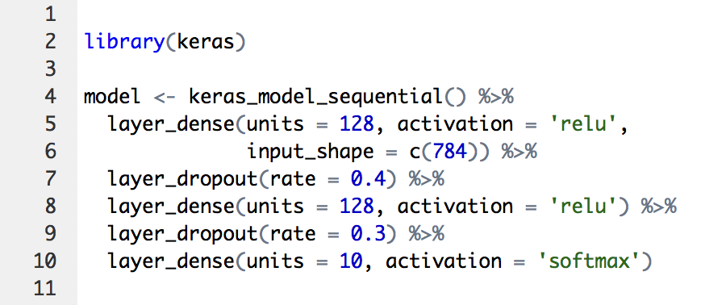
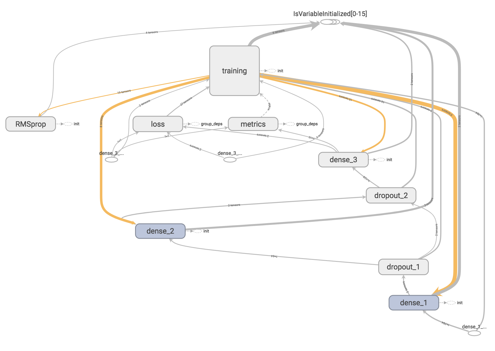
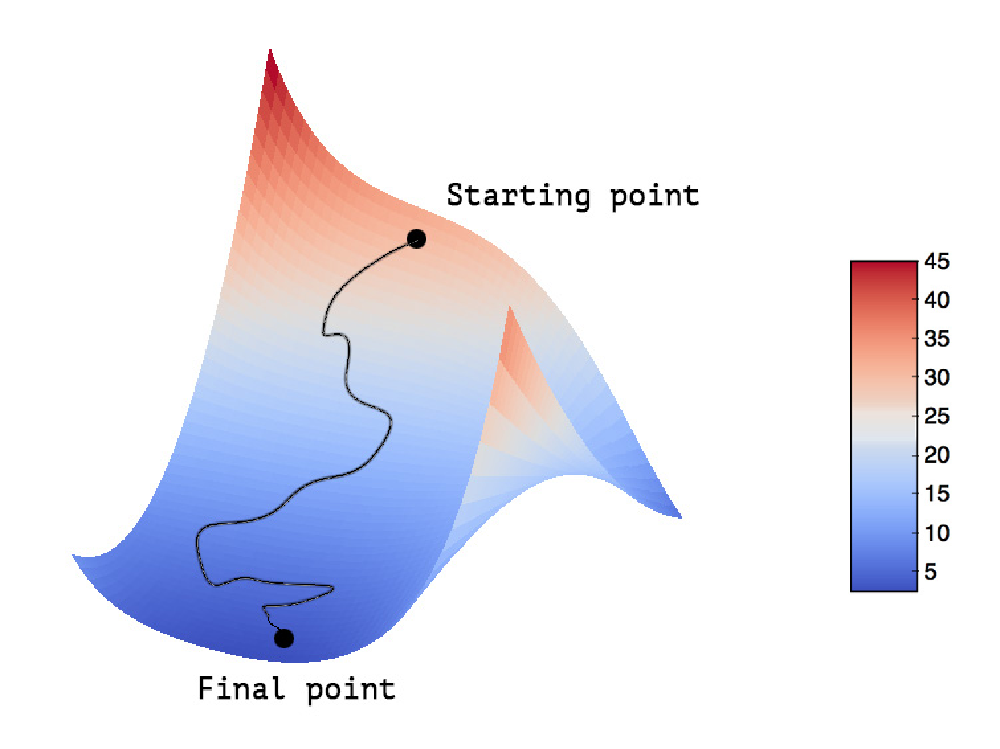
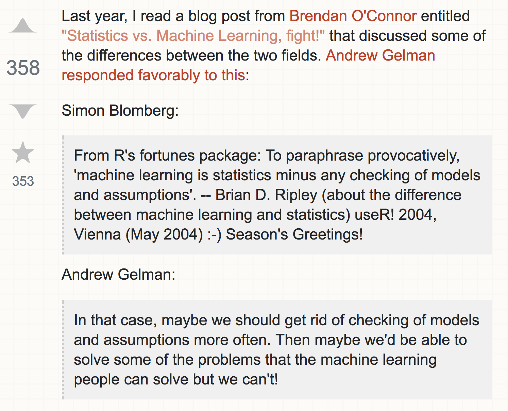
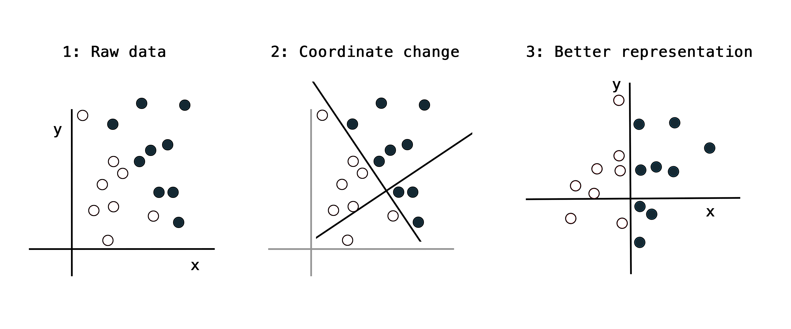
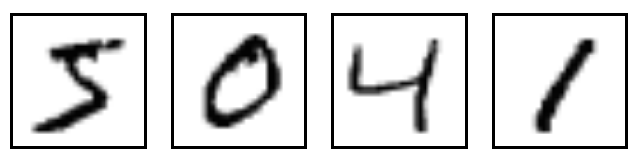
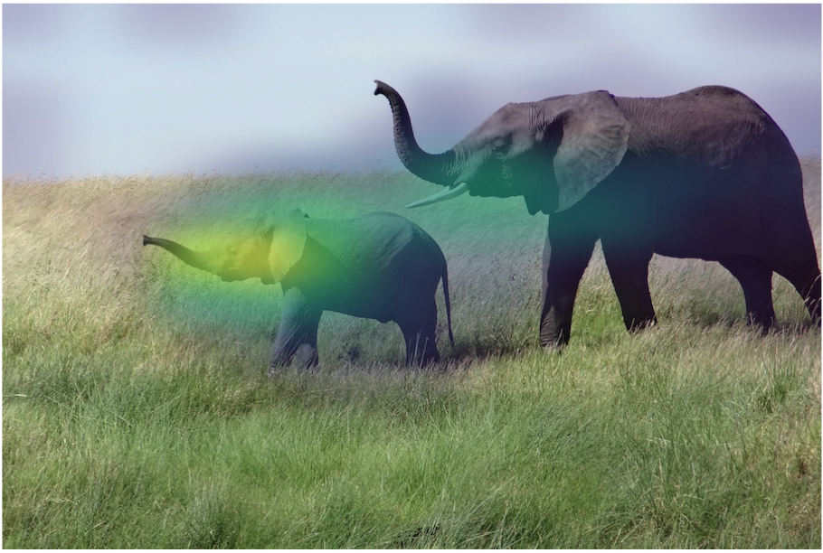
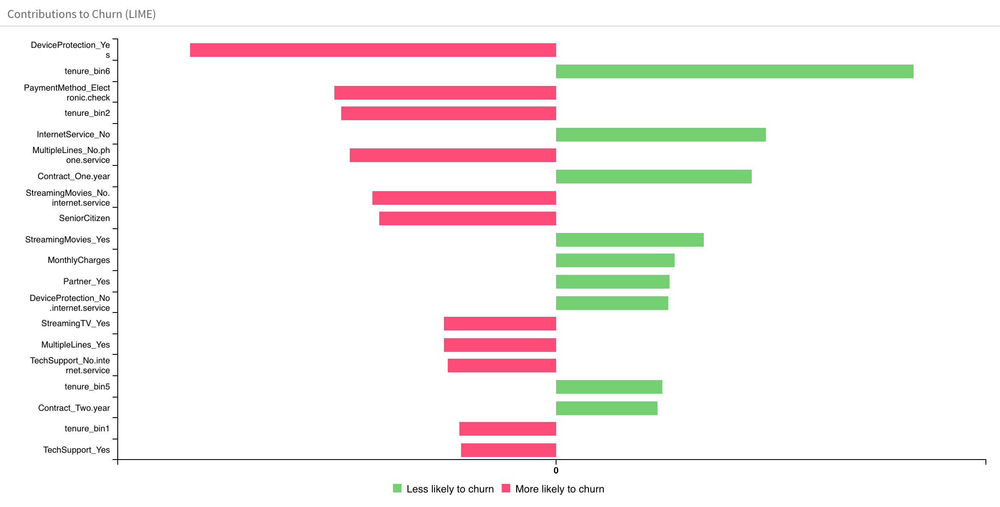
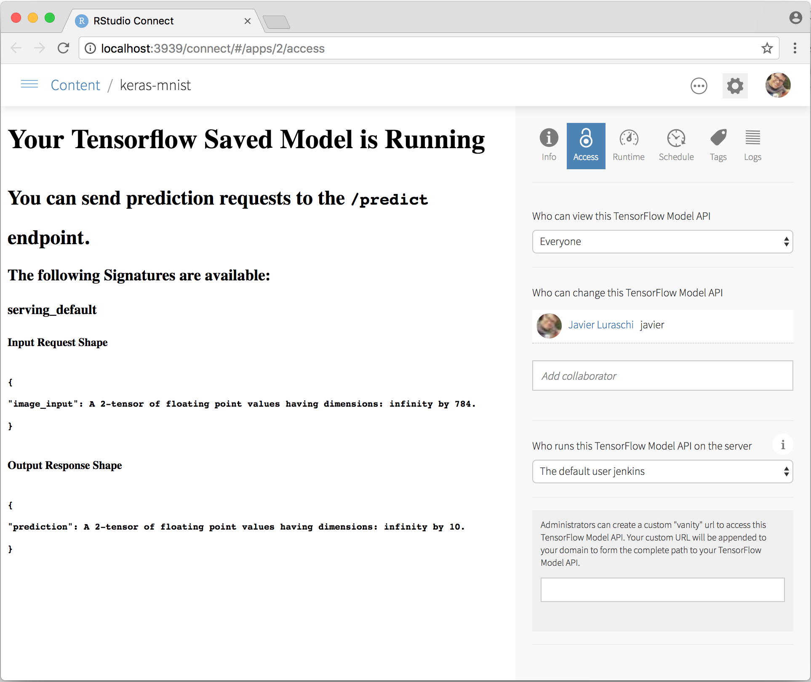

```{r setup, include=FALSE}
knitr::opts_chunk$set(eval = FALSE)
```

<style type="text/css">
.illustration {
  border: solid 1px #cccccc;
}
small {
  font-size: 0.6em;
}
h4 {
  margin-bottom: 15px; 
}
a {
  border-bottom: 0;
}
a:hover {
  color: #2a7cdf |important;
  border-bottom: 1px solid rgba(42, 124, 223, 0.5);
}
</style>


## Overview

- Intro to TensorFlow

- Deep Learning

- R Interfaces to TensorFlow

- Supporting Tools 

- Learning More

## What is TensorFlow? | *A general purpose numerical computing library* 

<div style="margin-top: -30px;">


-  Originally developed by researchers and engineers working on the Google Brain Team for the purposes of conducting machine learning and deep neural networks research.
- Open source software (Apache v2.0 license) 
- Hardware independent
    - CPU (via [Eigen](http://eigen.tuxfamily.org/) and [BLAS](https://en.wikipedia.org/wiki/Basic_Linear_Algebra_Subprograms))
    - GPU (via [CUDA](https://en.wikipedia.org/wiki/CUDA) and [cuDNN](https://developer.nvidia.com/cudnn))
    - TPU ([Tensor Processing Unit](https://en.wikipedia.org/wiki/Tensor_processing_unit))
- Supports [automatic differentiation](https://en.wikipedia.org/wiki/Automatic_differentiation)
- Distributed execution and large datasets
</div>

## Why should R users care? 

- A new general purpose numerical computing library! 
     - Hardware independent
     - Distributed execution
     - Large datasets
     - Automatic differentiation
     
- Very general built-in optimization algorithms (SGD, Adam) that don't require that all data is in RAM

- Robust foundation for machine learning and deep learning applications

- TensorFlow models can be deployed with a low-latency C++ runtime

- R has a lot to offer as an *interface language* for TensorFlow


## TensorFlow Basics

- Tensors 

- Data flow

- Runtime execution

- Some example uses


## What are tensors? | *Data stored in multidimensional arrays*

| Dimension | R object  | 
|---|---|
| 0D | `42` | 
| 1D | `c(42, 42, 42)` 
| 2D | `matrix(42, nrow = 2, ncol = 2)`  |
| 3D | `array(42, dim = c(2,3,2))` |
| 4D | `array(42, dim = c(2,3,2,3))` |

## Some examples

| Data | Tensor  | 
|---|---|
| Vector data | 2D tensors of shape `(samples, features)` | 
| Timeseries data | 3D tensors of shape `(samples, timesteps,
features)` |
| Images | 4D tensors of shape `(samples, height, width, channels)` |
| Video | 5D tensors of shape `(samples, frames, height, width, channels)` |

<br/>

Note that `samples` is always the first dimension


## 2D tensors | *Vector data*

```{r}
head(data.matrix(iris), n = 10)
```
```
      Sepal.Length Sepal.Width Petal.Length Petal.Width Species
 [1,]          5.1         3.5          1.4         0.2       1
 [2,]          4.9         3.0          1.4         0.2       1
 [3,]          4.7         3.2          1.3         0.2       1
 [4,]          4.6         3.1          1.5         0.2       1
 [5,]          5.0         3.6          1.4         0.2       1
 [6,]          5.4         3.9          1.7         0.4       1
 [7,]          4.6         3.4          1.4         0.3       1
 [8,]          5.0         3.4          1.5         0.2       1
 [9,]          4.4         2.9          1.4         0.2       1
[10,]          4.9         3.1          1.5         0.1       1
```

## 3D tensors | *Timeseries or sequence data*


## 4D tensors | *Image data*


## What is tensor "flow"? | A dataflow graph with nodes representing units of computation

<div style="margin-top: -20px;">


 
- You define the graph in R

- Graph is compiled and optimized

- Graph is executed on devices 

- Nodes represent computations

- Data (tensors) flows between them

</div>

## Graph is generated automatically from R code

<div class="columns-2">
  
**R Code**


  
**TensorFlow Graph**  



</div>


## Why a dataflow graph? | Major gains in performance and scalability 

<div style="margin-top: -30px;">
  


- **Parallelism**---System runs operations in parallel.
- **Distributed execution**---Graph is partitioned across multiple devices.
- **Compilation**---Use the information in your dataflow graph to generate faster code (e.g. fusing operations)
- **Portability**---Dataflow graph is a language-independent representation of the code in your model (deploy with C++ runtime)

</div>

## Uses of TensorFlow | <https://tensorflow.rstudio.com/learn/gallery/>

- Image classification 
- Time series forecasting 
- Classifing peptides for cancer immunotherapy
- Credit card fraud detection using an autoencoder
- Classifying duplicate questions from Quora
- Predicting customer churn
- Learning word embeddings for Amazon reviews

## Deep Learning

- What is deep learning?

- What is it useful for?

- Why should R users care?

- How does it work?

- Some examples

<br/>


Special thanks to François Chollet (creator of Keras) for the concepts and figures used to explain deep learning! (all drawn from Chapter 1 of his [Deep Learning with R](https://www.manning.com/books/deep-learning-with-r) book)


## What is deep learning? | A simple mechanism that, once scaled, ends up looking like magic


## What has deep learning achieved? | Complex geometric transformations, broken down into simpler ones {.smaller}


<div class="columns-2">

<div>
- Near-human-level image classification
- Near-human-level speech recognition
- Near-human-level handwriting transcription
- Improved machine translation
- Improved text-to-speech conversion
</div>

<div>
- Near-human-level autonomous driving
- Improved search results on the web
- Ability to answer natural language questions
- Superhuman Go playing
</div>

</div>


## Why should R users care about deep learning?

- New problem domains for R:
    - Computer vision
    - Computer speech recognition and translation
    - Various other forms of complex pattern recognition

- Improved techniques for our traditional domains:
    - Analyzing data with complex spatial or sequence dependencies
    - Analyzing data which requires a large amount of (potentially brittle) feature engineering to model effectively


## Machine learning basics | Learning model parameters via exposure to many example data points

<div style="margin-top: -38px;">


- Input data points (e.g. *images*)

- Labels (e.g. *cat* vs. *dog*)

- Model architecture (e.g. *logistic regression*)

- Loss function (measures performance of model, e.g. *categorical crossentroopy*)

- Loss is used as a feedback signal to an optimizer (e.g. *stochastic gradient descent*) to iteratively adjust the model parameters

- *Training* consists of feeding batches of data to training process to learn the optimal model parameters.

</div>

## Statistical modeling vs. machine learning | Could be an entire talk (or conference!). I'm not going there. {.smaller}

<div style="margin-top: -38px;">
<https://stats.stackexchange.com/questions/6/the-two-cultures-statistics-vs-machine-learning>
</div>

<div class="columns-2" >




</div>

## Statistical modeling vs. machine learning 

**Statistics**: Often focused on inferring the process by which data is generated.

**Machine learning**: Care principally about predicting future data.

<br/>

<div style="font-size: 0.8em;">
Breiman, L. (2001). [Statistical modeling: The two cultures](https://projecteuclid.org/download/pdf_1/euclid.ss/1009213726). *Statistical Science*, 16(3), 199--215.

Ayres, I. (2008). [Super Crunchers: Why Thinking-By-Numbers is the New Way To Be Smart](https://www.amazon.com/Super-Crunchers-Thinking-Numbers-Smart/dp/0553384732), Bantam. 

Shmueli, G. (2010). [To explain or to predict?](https://arxiv.org/pdf/1101.0891.pdf) *Statistical Science*, 25(3), 289--310.

Breiman, L. (1997). [No Bayesians in foxholes](http://ieeexplore.ieee.org/document/642956/). *IEEE Expert*, 12(6), 21--24. 

Boulesteix, A.-L., \& Schmid, M. (2014). [Machine learning versus statistical modeling](http://onlinelibrary.wiley.com/doi/10.1002/bimj.201300226/abstract). *Biometrical Journal*, 56(4), 588--593. (and other articles in this issue)
</div>

## Learning representations | Transforming input data into useful representations



Learning algorithms aren’t usually creative in finding these transformations; they’re merely searching through a predefined set of operations, called a *hypothesis space*.

## Input to output via layers of representation


## The "deep" in deep learning 

A new take on learning representations from data that puts an emphasis on learning successive layers of increasingly meaningful representations.

Other possibly more appropriate names for the field:

- Layered representations learning
- Hierarchical representations learning
- Chained geometric transformation learning

Modern deep learning often involves tens or even hundreds of successive layers of representation

Other approaches to machine learning tend to focus on learning only one or two layers of representations of the data

## Layers of representation | An information distillation pipeline {.smaller}


 
- Raw data goes in (in this case, grayscale images) 
- Data is transformed so that irrelevant information is filtered out (for example, the specific visual appearance of the image).
- Useful information is magnified and refined (for example, the class of the image).


## Using input data and labels to learn weights | A neural network is parameterized by its weights


## Evaluate the loss for each training batch | A loss function measures the quality of the network’s output {.smaller}

<div class="columns-2" style="margin-top: -20px;">


- The *loss function* takes the predictions of the network and the true targets (what you wanted the network to output) and computes a distance score, capturing how well the network has done on a batch of examples. 

- The fundamental trick in deep learning is to use this score as a feedback signal to adjust the value of the weights a little, in a direction that will lower the loss score for the current batch of examples. This adjustment is the job of the *optimizer*.

</div>

## Loss is a feedback signal used to adjust weights {.smaller}

<div class="columns-2"  style="margin-top: -20px;">


- Updates are done via the [backpropagation algorithm](https://en.wikipedia.org/wiki/Backpropagation), using the [chain rule](https://en.wikipedia.org/wiki/Chain_rule) to iteratively compute gradients for each layer.

- Traditional optimization algorithms update weights by averaging the gradients of all data points. To economize computational cost we use [stochastic gradient descent](https://en.wikipedia.org/wiki/Stochastic_gradient_descent) and only calculate gradients for a small random sample of the data. 

- The training loop, which, repeated a sufficient number of times (typically tens of iterations over thousands of examples), yields weight values that minimize the loss function.

</div>

## MNIST layers of representation


 

## MNIST layers in R

```{r}
library(keras)
model <- keras_model_sequential() %>%
  layer_conv_2d(filters = 32, kernel_size = c(3,3), activation = 'relu',
                input_shape = input_shape) %>% 
  layer_conv_2d(filters = 64, kernel_size = c(3,3), activation = 'relu') %>% 
  layer_max_pooling_2d(pool_size = c(2, 2)) %>% 
  layer_dropout(rate = 0.25) %>% 
  layer_flatten() %>% 
  layer_dense(units = 128, activation = 'relu') %>% 
  layer_dropout(rate = 0.5) %>% 
  layer_dense(units = 10, activation = 'softmax')
```


## What is deep learning? 


Deep-learning models are mathematical machines for uncrumpling complicated manifolds of high-dimensional data.

Deep learning is turning meaning into vectors, into geometric spaces, and then incrementally learning complex geometric transformations that map one space to another.

How can we do this with simple parametric models trained with gradient descent? We just need sufficiently large parametric models trained with gradient descent on sufficiently many examples. 

## Deep learning frontiers

- Computer vision

- Natural language processing

- Time series

- Biology

- What next?


## Computer vision | <https://dl.acm.org/citation.cfm?id=2999257> 

<div style="margin-top: -30px;">


- ImageNet: 3.2 million labelled images, separated into 5,247 categories, sorted into 12 subtrees like “mammal,” “vehicle,” and “furniture.”

- ImageNet Challenge: An annual competition (2010-2017) to see which algorithms could identify objects in the dataset’s images with the lowest error rate.

- Accuracy improved from 71.8% to 97.3% over the lifetime of the contest.

- Deep learning was used for the first time in 2012, and beat the field by 10.8%.

</div>

## Natural language processing | https://arxiv.org/abs/1708.02709

<div style="margin-top: -10px;">


</div>


## Language translation | https://arxiv.org/abs/1609.08144 {.smaller}

<div style="margin-top: -38px;">
Google's Neural Machine Translation System


</div>

## Time series | http://ieeexplore.ieee.org/document/7870510/


## Time series | http://journals.plos.org/plosone/article?id=10.1371/journal.pone.0180944


## Biology | https://www.biorxiv.org/content/early/2018/01/19/142760


## What next? | <https://arxiv.org/abs/1801.07860>


## Some problems with deep learning models

- Not easily interpreted (black box)
- Can be brittle (see "adversarial examples")
- Typically require large amounts of data to perform well
- Are often very computationally expensive to train

## Deep learning hype makes things worse | My model is *deep* so it must be better!

- Deep learning is experiencing unprecedted hype, and...
- The current generation of tools make deep learning accessible to many with no prior experience in statistics or modeling, however...
- It can be difficult to outperform traditional modeling techniques without a lot of effort, so...
- We will be trolled by bad deep learning models for the forseeable future

Of course we can help here by promoting a more balanced dialog about the strenghts and weaknesses of these methods.

## In spite of problems, extraordinarly useful! | We should help DL find it's appropriate place rather than dismiss it


## R interface to Tensorflow | https://tensorflow.rstudio.com

- High-level R interfaces for neural nets and traditional models

- Low-level interface to enable new applications (e.g. Greta)

- Tools to facilitate productive workflow / experiment management

- Straightforward access to GPUs for training models

- Breadth and depth of educational resources


## TensorFlow APIs | Distinct interfaces for various tasks and levels of abstraction


## R packages

<div class="columns-2">

### TensorFlow APIs

- [keras](https://tensorflow.rstudio.com/keras/)---Interface for neural networks, with a focus on enabling fast experimentation.
- [tfestimators](https://tensorflow.rstudio.com/tfestimators/)--- Implementations of common model types such as regressors and classifiers. 
- [tensorflow](https://tensorflow.rstudio.com/tensorflow/)---Low-level interface to the TensorFlow computational graph.
- [tfdatasets](https://tensorflow.rstudio.com/tools/tfdatasets/)---Scalable input pipelines for TensorFlow models. 

### Supporting tools

- [tfruns](https://tensorflow.rstudio.com/tools/tfruns/)---Track, visualize, and manage TensorFlow training runs and experiments.
- [tfdeploy](https://tensorflow.rstudio.com/tools/tfdeploy/)---Tools designed to make exporting and serving TensorFlow models straightforward.
- [cloudml](https://tensorflow.rstudio.com/tools/cloudml/)---R interface to Google Cloud Machine Learning Engine. 

</div>


## TensorFlow Keras API | High level API for nueral networks <br/> <https://tensorflow.rstudio.com/keras/> 

```{r}
library(keras)
model <- keras_model_sequential() %>%
  layer_conv_2d(filters = 32, kernel_size = c(3,3), activation = 'relu',
                input_shape = input_shape) %>% 
  layer_conv_2d(filters = 64, kernel_size = c(3,3), activation = 'relu') %>% 
  layer_max_pooling_2d(pool_size = c(2, 2)) %>% 
  layer_dropout(rate = 0.25) %>% 
  layer_flatten() %>% 
  layer_dense(units = 128, activation = 'relu') %>% 
  layer_dropout(rate = 0.5) %>% 
  layer_dense(units = 10, activation = 'softmax')
```


## TensorFlow Estimators | High level API for TensorFlow models <https://tensorflow.rstudio.com/tfestimators/> {.smaller}

| Estimator | Description |
|---|--------------|
| linear_regressor() | Linear regressor model. |
| linear_classifier()	| Linear classifier model. |
| dnn_regressor()	| Dynamic neural network regression. |
| dnn_classifier() |	Dynamic neural network classification. |
| dnn_linear_combined_regressor() |	DNN Linear Combined Regression. |
| dnn_linear_combined_classifier() | DNN Linear Combined Classification. |

## TensorFlow Core API | Low level access to TensorFlow graph operations <https://tensorflow.rstudio.com/tensorflow/> {.smaller}

```{r}
library(tensorflow)

W <- tf$Variable(tf$random_uniform(shape(1L), -1.0, 1.0))
b <- tf$Variable(tf$zeros(shape(1L)))
y <- W * x_data + b

loss <- tf$reduce_mean((y - y_data) ^ 2)
optimizer <- tf$train$GradientDescentOptimizer(0.5)
train <- optimizer$minimize(loss)

sess = tf$Session()
sess$run(tf$global_variables_initializer())

for (step in 1:200)
  sess$run(train)
```

## Greta | Writing statistical models and fitting them by MCMC

<div style="margin-top: -38px;">
<https://greta-dev.github.io/greta/>


</div>

## Air Model: Greta vs. BUGS/JAGS

<div style="margin-top: -20x;">
```{r}
# Greta
theta <- normal(0, 32, dim = 2)
mu <- alpha + beta * Z
X <- normal(mu, sigma)
p <- ilogit(theta[1] + theta[2] * X)
distribution(y) <- binomial(n, p)
```

```{r}
# BUGS/JAGS
for(j in 1 : J) {
   y[j] ~ dbin(p[j], n[j])
   logit(p[j]) <- theta[1] + theta[2] * X[j]
   X[j] ~ dnorm(mu[j], tau)
   mu[j] <- alpha + beta * Z[j]
}
theta[1] ~ dnorm(0.0, 0.001)
theta[2] ~ dnorm(0.0, 0.001)
```
</div>

## R interface to Keras

- Step-by-step example
- Keras layers
- Compiling models
- Losses, optimizers, and metrics
- More examples

## Keras: Data preprocessing 



```{r}
library(keras)

# Load MNIST images datasets (built in to Keras)
c(c(x_train, y_train), c(x_test, y_test)) %<-% dataset_mnist()

# Flatten images and transform RGB values into [0,1] range 
x_train <- array_reshape(x_train, c(nrow(x_train), 784))
x_test <- array_reshape(x_test, c(nrow(x_test), 784))
x_train <- x_train / 255
x_test <- x_test / 255

# Convert class vectors to binary class matrices
y_train <- to_categorical(y_train, 10)
y_test <- to_categorical(y_test, 10)
```

## Keras: Model definition

```{r}
model <- keras_model_sequential()  %>% 
  layer_dense(units = 256, activation = 'relu', input_shape = c(784)) %>% 
  layer_dropout(rate = 0.4) %>% 
  layer_dense(units = 128, activation = 'relu') %>%
  layer_dropout(rate = 0.3) %>%
  layer_dense(units = 10, activation = 'softmax')

model %>% compile(
  loss = 'categorical_crossentropy',
  optimizer = optimizer_rmsprop(),
  metrics = c('accuracy')
)
```


## Note: Models are modified in-place | Object semantics are not by-value! (as is conventional in R)

```{r}
# Modify model object in place (note that it is not assigned back to)
model %>% compile(
  optimizer = 'rmsprop',
  loss = 'binary_crossentropy',
  metrics = c('accuracy')
)
```

- Keras models are directed acyclic graphs of layers whose state is updated during training.

- Keras layers can be shared by multiple parts of a Keras model.


## Keras: Model summary {.smaller}

```{r}
summary(model)
```
```
_____________________________________________________________________________________
Layer (type)                          Output Shape                      Param #      
=====================================================================================
dense_1 (Dense)                       (None, 256)                       200960       
_____________________________________________________________________________________
dropout_1 (Dropout)                   (None, 256)                       0            
_____________________________________________________________________________________
dense_2 (Dense)                       (None, 128)                       32896        
_____________________________________________________________________________________
dropout_2 (Dropout)                   (None, 128)                       0            
_____________________________________________________________________________________
dense_3 (Dense)                       (None, 10)                        1290         
=====================================================================================
Total params: 235,146
Trainable params: 235,146
Non-trainable params: 0
_____________________________________________________________________________________
```


## Keras: Model training

```{r}
history <- model %>% fit(
  x_train, y_train,
  batch_size = 128,
  epochs = 30,
  validation_split = 0.2
)
```

```{r}
history
```
```
Trained on 48,000 samples, validated on 12,000 samples (batch_size=128, epochs=30)
Final epoch (plot to see history):
     acc: 0.9057
    loss: 1.5
 val_acc: 0.9317
val_loss: 1.088 
```

## Keras: Model training (cont.)

```{r}
plot(history)
```


## Keras: Evaluation and prediction

```{r}
model %>% evaluate(x_test, y_test)
```
```
$loss
[1] 0.1078904

$acc
[1] 0.9815
```

```{r}
model %>% predict_classes(x_test[1:100,])
```
```
  [1] 7 2 1 0 4 1 4 9 5 9 0 6 9 0 1 5 9 7 3 4 9 6 6 5 4 0 7 4 0 1 3 1 3 4 7
 [36] 2 7 1 2 1 1 7 4 2 3 5 1 2 4 4 6 3 5 5 6 0 4 1 9 5 7 8 9 3 7 4 6 4 3 0
 [71] 7 0 2 9 1 7 3 2 9 7 7 6 2 7 8 4 7 3 6 1 3 6 9 3 1 4 1 7 6 9
```

## Keras API: Layers | 65 layers available (you can also create your own layers) {.smaller}

<div style="margin-top: -35px;">
|  |  |
|---|--------------|
| layer_dense() | Add a densely-connected NN layer to an output. |
| layer_dropout()	| Applies Dropout to the input. |
| layer_batch_normalization() | Batch normalization layer (Ioffe and Szegedy, 2014). |
| layer_conv_2d()	| 2D convolution layer (e.g. spatial convolution over images). |
| layer_max_pooling_2d()  | Max pooling operation for spatial data. |
| layer_gru() | Gated Recurrent Unit - Cho et al. |
| layer_lstm() |	Long-Short Term Memory unit. |
| layer_embedding() |	Turns positive integers (indexes) into dense vectors of fixed size. |
| layer_reshape() | Reshapes an output to a certain shape. |
| layer_flatten() | Flattens an input. |
</div>


## Keras API: Compiling models

Model compilation prepares the model for training by:

1) Converting the layers into a TensorFlow graph
2) Applying the specified loss function and optimizer
3) Arranging for the collection of metrics during training

```{r}
model %>% compile(
  loss = 'categorical_crossentropy',
  optimizer = optimizer_rmsprop(),
  metrics = c('accuracy')
)
```


## Keras API: Losses | https://tensorflow.rstudio.com/keras/reference/#section-losses {.smaller}

`loss_binary_crossentropy()`   
`loss_categorical_crossentropy()`   
`loss_categorical_hinge()`  
`loss_cosine_proximity()`  
`loss_hinge()`  
`loss_kullback_leibler_divergence()`   
`loss_logcosh()`   
`loss_mean_absolute_error()`   
`loss_mean_absolute_percentage_error()`   
`loss_mean_squared_error()`   
`loss_mean_squared_logarithmic_error()`   
`loss_poisson()`  
`loss_sparse_categorical_crossentropy()`   
`loss_squared_hinge()`   


## Keras API: Optimizers | https://tensorflow.rstudio.com/keras/reference/#section-optimizers {.smaller}

`optimizer_adadelta()`  
`optimizer_adagrad()`  
`optimizer_adam()`  
`optimizer_adamax()`  
`optimizer_nadam()`  
`optimizer_rmsprop()`  
`optimizer_sgd()`  

## Keras API: Metrics | https://tensorflow.rstudio.com/keras/reference/#section-metrics {.smaller}

`metric_binary_accuracy()`  
`metric_binary_crossentropy()`  
`metric_categorical_accuracy()`  
`metric_categorical_crossentropy()`  
`metric_cosine_proximity()`  
`metric_hinge()`  
`metric_kullback_leibler_divergence()`  
`metric_mean_absolute_error()`  
`metric_mean_absolute_percentage_error()`  
`metric_mean_squared_error()`  
`metric_mean_squared_logarithmic_error()`  
`metric_poisson()`  
`metric_sparse_categorical_crossentropy()`  
`metric_sparse_top_k_categorical_accuracy()`  
`metric_squared_hinge()`  
`metric_top_k_categorical_accuracy()`  

## Keras for R cheatsheet | <https://github.com/rstudio/cheatsheets/raw/master/keras.pdf>

<a style="border-bottom: none;" href="https://github.com/rstudio/cheatsheets/raw/master/keras.pdf"></a>


## Some R examples | https://tensorflow.rstudio.com/gallery/

- Image classification on small datasets
- Time series forecasting with recurrent networks
- Deep learning for cancer immunotherapy
- Credit card fraud detection using an autoencoder
- Classifying duplicate questions from Quora
- Deep learning to predict customer churn
- Learning word embeddings for Amazon reviews
- Work on explainabilty of predictions


## Image classification on small datasets | <small>https://tensorflow.rstudio.com/blog/keras-image-classification-on-small-datasets</small> {.smaller}

<div class="columns-2" style="margin-top: -10px;">


- Demonstrates *transfer learning* (training a new model with a pre-trained model as a starting point) for image classification.

- Achieves 97% prediction accuracy on dogs-vs-cats dataset trained on only 2,000 input images.
</div>


## Time series forecasting with recurrent networks | <small>https://tensorflow.rstudio.com/blog/time-series-forecasting-with-recurrent-neural-networks.html</small> {.smaller}

<div class="columns-2" style="margin-top: -10px;">


- Forecasting temperatures with a [weather timeseries dataset](https://www.bgc-jena.mpg.de/wetter/) recorded at the Weather Station at the Max Planck Institute for Biogeochemistry in Jena, Germany.

- Reviews three advanced techniques for improving the performance and generalization power of recurrent neural networks: recurrent dropout, stacking recurrent layers, and bidirectional recurrent layers.

</div>


## Deep learning for cancer immunotherapy | <https://tensorflow.rstudio.com/blog/dl-for-cancer-immunotherapy.html> {.smaller}


<div class="columns-2" style="margin-top: -10px;">


- Illustrates how deep learning is successfully being applied to model key molecular interactions in the human immune system.

- Molecular interactions are highly context dependent and therefore non-linear. Deep learning is a powerful tool for modeling this non-linearity.

</div>


## Credit card fraud detection using an autoencoder | <https://tensorflow.rstudio.com/blog/keras-fraud-autoencoder.html> {.smaller}

<div class="columns-2" style="margin-top: -30px;">


- An [autoencoder](https://en.wikipedia.org/wiki/Autoencoder) is a neural network that is used to learn a representation (encoding) for a set of data, typically for the purpose of dimensionality reduction.

-  For this problem we train an autoencoder to encode non-fraud observations from our training set.

- Since frauds are supposed to have a different distribution then normal transactions, we expect that our autoencoder will have higher reconstruction errors on frauds then on normal transactions.

</div>


## Classifying duplicate questions from Quora | <small>https://tensorflow.rstudio.com/blog/keras-duplicate-questions-quora.html</small> {.smaller}

<div class="columns-2" style="margin-top: -30px;">


- Uses Kaggle [Quora Question Pairs](https://www.kaggle.com/c/quora-question-pairs) dataset and consists of approximately 400,000 pairs of questions along with a column indicating if the question pair is considered a duplicate.

- Learn a function that maps input patterns into a target space such that a similarity measure in the target space approximates the “semantic” distance in the input space.

- Bonus: Shiny front-end application to score example questions.

</div>


## Deep learning to predict customer churn | <small>https://tensorflow.rstudio.com/blog/keras-customer-churn.html</small> {.smaller}

<div class="columns-2" style="margin-top: -30px;">


- Model customer churn risk using a simple multi-layer perceptron
- Demonstrates the use of the [recipes](https://topepo.github.io/recipes/) package for data preprocessing.
- Demonstrates use of the [lime](https://github.com/thomasp85/lime) package to explain the features driving individual model predictions.
- Includes a Shiny application with a customer scorecard to monitor customer churn risk.

</div>


## Learning word embeddings for Amazon reviews | <small>https://tensorflow.rstudio.com/blog/word-embeddings-with-keras.html</small>{.smaller}


<div class="columns-2" style="margin-top: -30px;">


- Word embedding is a method used to map words of a vocabulary to dense vectors of real numbers where semantically similar words are mapped to nearby points. 

- This in turn can improve natural language processing tasks like syntactic parsing and sentiment analysis by grouping similar words.


</div>

## Explainability: Visualizing activations | <small>https://jjallaire.github.io/deep-learning-with-r-notebooks/notebooks/5.4-visualizing-what-convnets-learn.nb.html</small> 

<div style="margin-top: -20px;">
```{r}
preds <- model %>% predict(img)
imagenet_decode_predictions(preds, top = 3)[[1]]
```
```
  class_name class_description       score
1  n02504458  African_elephant 0.909420729
2  n01871265            tusker 0.086183183
3  n02504013   Indian_elephant 0.004354581
```

&nbsp;&nbsp;
</div>

## Explainabilty: LIME | Local Interpretable Model-Agnostic Explanations {.smaller}

<div style="margin-top: -30px;">
- For any given prediction and any given classifier, determine a small set of features in the original data that has driven the outcome of the prediction.

- Paper: <https://arxiv.org/abs/1602.04938>

- R implementation: <https://github.com/thomasp85/lime>
</div>




## Deep learning frontiers (revisited)

- Many fields of inquiry have a deep learning frontier that has not yet been reached or even well approached.

- In these cases traditional methods are invariably cheaper and more accurate.

- Some possible approaches:
    - Wait and see
    - Follow/evaluate the latest research
    - Attempt to approach the frontier in your own work
    
- To approach the frontier you need understanding of the full range of DL techniques, iteration, patience, and lots of compute power!    

## Supporting tools

| Tool | Description |
|---------------|---------------------------------------------------------------|
| [GPUs](https://tensorflow.rstudio.com/tools/gpu/)  | Using GPUs locally or in the cloud.  |
| [tfruns](https://tensorflow.rstudio.com/tools/tfruns/)  | Track and manage  training runs and experiments. |
| [cloudml](https://tensorflow.rstudio.com/tools/cloudml/) |  R interface to [Google Cloud Machine Learning Engine](https://cloud.google.com/ml-engine/). |
| [tfdeploy](https://tensorflow.rstudio.com/tools/tfdeploy/)  | Exporting and deploying TensorFlow models. |

## GPUs | <https://tensorflow.rstudio.com/tools/gpu/> {.smaller}

<div style="margin-top: -30px;">
Some applications---in particular, image processing with convolutional networks and sequence processing with recurrent neural networks---will be excruciatingly slow on CPU.
</div>


## tfruns package | <https://tensorflow.rstudio.com/tools/tfruns/>

Successful deep learning requires a huge amount of experimentation.

This requires a systematic approach to conducting and tracking the results of experiments.

The `training_run()` function is like the `source()` function, but it automatically tracks and records output and metadata for the execution of the script:

```{r}
library(tfruns)
training_run("mnist_mlp.R")
```

## tfruns::ls_runs() {.smaller}

```{r}
ls_runs()
```
```
Data frame: 4 x 28 
                    run_dir eval_loss eval_acc metric_loss metric_acc metric_val_loss metric_val_acc
1 runs/2017-12-09T21-01-11Z    0.1485   0.9562      0.2577     0.9240          0.1482         0.9545
2 runs/2017-12-09T21-00-11Z    0.1438   0.9573      0.2655     0.9208          0.1505         0.9559
3 runs/2017-12-09T19-59-44Z    0.1407   0.9580      0.2597     0.9241          0.1402         0.9578
4 runs/2017-12-09T19-56-48Z    0.1437   0.9555      0.2610     0.9227          0.1459         0.9551
```

```{r}
ls_runs(eval_acc > 0.9570, order = eval_acc)
```
```
Data frame: 2 x 28 
                    run_dir eval_acc eval_loss metric_loss metric_acc metric_val_loss metric_val_acc
1 runs/2017-12-09T19-59-44Z   0.9580    0.1407      0.2597     0.9241          0.1402         0.9578
2 runs/2017-12-09T21-00-11Z   0.9573    0.1438      0.2655     0.9208          0.1505         0.9559
```
## tfruns::view_run()


## tfruns::compare_runs()


## tfruns::flags()

```{r}
# define flags and their defaults
FLAGS <- flags(
  flag_integer("dense_units1", 128),
  flag_numeric("dropout1", 0.4),
  flag_integer("dense_units2", 128),
  flag_numeric("dropout2", 0.3)
)
```

```{r}
# use flag 
layer_dropout(rate = FLAGS$dropout1)
```

```{r}
# train with flag
training_run("mnist_mlp.R", flags = list(dropout1 = 0.3))
```

## tfruns::tuning_run() {.smaller}

```{r}
# run various combinations of dropout1 and dropout2
runs <- tuning_run("mnist_mlp.R", flags = list(
  dropout1 = c(0.2, 0.3, 0.4),
  dropout2 = c(0.2, 0.3, 0.4)
))
```

```{r}
# find the best evaluation accuracy
runs[order(runs$eval_acc, decreasing = TRUE), ]
```
```
Data frame: 9 x 28 
                    run_dir eval_loss eval_acc metric_loss metric_acc metric_val_loss metric_val_acc
9 runs/2018-01-26T13-21-03Z    0.1002   0.9817      0.0346     0.9900          0.1086         0.9794
6 runs/2018-01-26T13-23-26Z    0.1133   0.9799      0.0409     0.9880          0.1236         0.9778
5 runs/2018-01-26T13-24-11Z    0.1056   0.9796      0.0613     0.9826          0.1119         0.9777
4 runs/2018-01-26T13-24-57Z    0.1098   0.9788      0.0868     0.9770          0.1071         0.9771
2 runs/2018-01-26T13-26-28Z    0.1185   0.9783      0.0688     0.9819          0.1150         0.9783
3 runs/2018-01-26T13-25-43Z    0.1238   0.9782      0.0431     0.9883          0.1246         0.9779
8 runs/2018-01-26T13-21-53Z    0.1064   0.9781      0.0539     0.9843          0.1086         0.9795
7 runs/2018-01-26T13-22-40Z    0.1043   0.9778      0.0796     0.9772          0.1094         0.9777
1 runs/2018-01-26T13-27-14Z    0.1330   0.9769      0.0957     0.9744          0.1304         0.9751
```

## cloudml package | <https://tensorflow.rstudio.com/tools/cloudml/>

<div  style="margin-top: -10px;">


- Scalable training of models built with the keras, tfestimators, and tensorflow R packages.

- On-demand access to training on GPUs, including the new Tesla P100 GPUs from NVIDIA®.

- Hyperparameter tuning to optimize key attributes of model architectures in order to maximize predictive accuracy.

</div>

## Use this from the comfort of your own laptop!


## cloudml::cloudml_train() 

Train on default CPU instance:

```{r}
library(cloudml)
cloudml_train("mnist_mlp.R")
```

Automatically uploads contents of working directory along with script

Automatically installs all required R packages on CloudML servers


```{r}
# Train on a GPU instance
cloudml_train("mnist_mlp.R", master_type = "standard_gpu")

# Train on an NVIDIA Tesla P100 GPU
cloudml_train("mnist_mlp.R", master_type = "standard_p100")
```


## cloudml::job_collect()

```{r}
job_collect()
```

<div class="columns-2">


- Collects job metadata and all files created by the job (e.g. event logs, saved models)

- Uses tfruns to allow inspection, enumeration, and comparison of jobs

</div>

## cloudml: ls_runs() {.smaller}

```{r}
ls_runs()
```
```
Data frame: 6 x 37 
                            run_dir eval_loss eval_acc metric_loss metric_acc metric_val_loss metric_val_acc
6 runs/cloudml_2018_01_26_135812740    0.1049   0.9789      0.0852     0.9760          0.1093         0.9770
2 runs/cloudml_2018_01_26_140015601    0.1402   0.9664      0.1708     0.9517          0.1379         0.9687
5 runs/cloudml_2018_01_26_135848817    0.1159   0.9793      0.0378     0.9887          0.1130         0.9792
3 runs/cloudml_2018_01_26_135936130    0.0963   0.9780      0.0701     0.9792          0.0969         0.9790
1 runs/cloudml_2018_01_26_140045584    0.1486   0.9682      0.1860     0.9504          0.1453         0.9693
4 runs/cloudml_2018_01_26_135912819    0.1141   0.9759      0.1272     0.9655          0.1087         0.9762
# ... with 30 more columns:
#   flag_dense_units1, flag_dropout1, flag_dense_units2, flag_dropout2, samples, validation_samples,
#   batch_size, epochs, epochs_completed, metrics, model, loss_function, optimizer, learning_rate,
#   script, start, end, completed, output, source_code, context, type, cloudml_console_url,
#   cloudml_created, cloudml_end, cloudml_job, cloudml_log_url, cloudml_ml_units, cloudml_start,
#   cloudml_state
```

## CloudML hyperparameter tuning | Start by using FLAGS in your training script

<div style="margin-top: -38px;">
```{r}
FLAGS <- flags(
  flag_integer("dense_units1", 128),
  flag_numeric("dropout1", 0.4),
  flag_integer("dense_units2", 128),
  flag_numeric("dropout2", 0.3)
)

model <- keras_model_sequential() %>% 
  layer_dense(units = FLAGS$dense_units1, activation = 'relu', 
              input_shape = c(784)) %>%
  layer_dropout(rate = FLAGS$dropout1) %>%
  layer_dense(units = FLAGS$dense_units2, activation = 'relu') %>%
  layer_dropout(rate = FLAGS$dropout2) %>%
  layer_dense(units = 10, activation = 'softmax')
```
</div>

## CloudML hyperparameter tuning (cont.) | Create a tuning configuration file (tuning.yml)

<div style="margin-top: -38px;">
```yaml
trainingInput:
  hyperparameters:
    goal: MAXIMIZE
    hyperparameterMetricTag: acc
    maxTrials: 10
    params:
      - parameterName: dropout1
        type: DOUBLE
        minValue: 0.2
        maxValue: 0.6
        scaleType: UNIT_LINEAR_SCALE
      - parameterName: dropout2
        type: DOUBLE
        minValue: 0.1
        maxValue: 0.5
        scaleType: UNIT_LINEAR_SCALE
```
</div>

## CloudML hyperparameter tuning (cont.) | Run the tuning job and inspect trials{.smaller}

<div style="margin-top: -38px;">
```{r}
cloudml_train("minst_mlp.R", config = "tuning.yml")
```

```{r}
job_trials()
```
```
finalMetric.objectiveValue finalMetric.trainingStep hyperparameters.dropout1 hyperparameters.dropout2 trialId
1                    0.973854                       19       0.2011326172916916      0.32774705750441724      10
2                    0.973458                       19      0.20090378506439671      0.10079321757280404       3
3                    0.973354                       19       0.5476299090261757      0.49998941144858033       6
4                    0.972875                       19        0.597820322273044       0.4074512354566201       7
5                    0.972729                       19      0.25969787952729828      0.42851076497180118       1
6                    0.972417                       19      0.20045494784980847      0.15927383711937335       4
7                    0.972188                       19      0.33367593781223304      0.10077055587860367       5
8                    0.972188                       19      0.59880072314674071      0.10476853415572558       9
9                    0.972021                       19         0.40078175292512      0.49982245025905447       8
10          
```
</div>

## CloudML hyperparameter tuning (cont.) | Collect the best performing trial

<div style="margin-top: -38px;">
```{r}
job_collect(trials = "best")
```

<div class="columns-2">


- Collects trial with best objective metric by default

- Specify `trials = "all"` to collect all trials (runs) and then perform offline analysis of hyperparameter interactions via `ls_runs()`.

</div>
</div>

## tfdeploy package | <https://tensorflow.rstudio.com/tools/tfdeploy/>

- TensorFlow was built from the ground up to enable deployment using a low-latency C++ runtime.

- Deploying TensorFlow models requires no runtime R or Python code.

- Key enabler for this is the TensorFlow [SavedModel](https://github.com/tensorflow/tensorflow/blob/master/tensorflow/python/saved_model/README.md format):

    *SavedModel provides a language-neutral format to save machine-learned models that is recoverable and hermetic. It enables higher-level systems and tools to produce, consume and transform TensorFlow models.*

- TensorFlow models can be deployed to servers, embedded devices, mobile phones, and even to a web browser!

## Deployment: Exporting a SavedModel

```{r}
model <- keras_model_sequential( %>% )
  layer_dense(units = 256, activation = 'relu', input_shape = c(784),
### <b>
              name = "image") %>%
### </b>
  layer_dense(units = 128, activation = 'relu') %>%
  layer_dense(units = 10, activation = 'softmax',
### <b>
              name = "prediction")
### </b>
```

Note that we give the input and output layers names ("image" and "prediction")

```{r}
# ...compile and fit model

# export model
library(tfdeploy)
export_savedmodel(model, "savedmodel")
```

## Deployment: serve_savedmodel() | Provide a local HTTP REST interface to the model from R

<div style="margin-top: -38px;">
```{r}
serve_savedmodel("savedmodel")
```


</div>

## Deployment: TensorFlow Serving | <https://www.tensorflow.org/serving/>

<div style="margin-top: -38px;">
<div class="columns-2">


TensorFlow Serving is a flexible, high-performance serving system for machine learning models, designed for production environments. 

TensorFlow Serving makes it easy to deploy new algorithms and experiments, while keeping the same server architecture and APIs. 

TensorFlow Serving provides out-of-the-box integration with TensorFlow models, but can be easily extended to serve other types of models and data.

</div>
</div>


## Deployment: RStudio Connect | <https://www.rstudio.com/products/connect/>

<div style="margin-top: -30px;">
```{r}
library(rsconnect)
deployTFModel("savedmodel", account = <username>, server = <internal_connect_server>)
```

<div class="columns-2">



</div>
</div>


## Deployment: CloudML | <https://tensorflow.rstudio.com/tools/cloudml/articles/deployment.html>

```{r}
library(cloudml)
cloudml_deploy("savedmodel", name = "keras_mnist")
```
```
Copying file://savedmodel/variables/variables.data-00000-of-00001 ...
Copying file://savedmodel/saved_model.pb ...
Copying file://savedmodel/variables/variables.index ...
/ [3/3 files][  1.9 MiB/  1.9 MiB] 100% Done                                    
Operation completed over 3 objects/1.9 MiB.

Model created and available in https://console.cloud.google.com/mlengine/models/keras_mnist
```


## Deployment: Embedded, mobile, and browser

- Run on embedded devices (e.g. [Raspberry Pi](https://github.com/samjabrahams/tensorflow-on-raspberry-pi))

- Keras models can be converted to iOS [CoreML](https://developer.apple.com/documentation/coreml/converting_trained_models_to_core_ml)

- Keras models can be deployed to the browser with [Keras.js](https://transcranial.github.io/keras-js/#/)

- Additional projects:
    - [TensorFlow Lite](https://www.tensorflow.org/mobile/tflite/)
    - [deeplearn.js](https://deeplearnjs.org/)
    

Attend Javier Luraschi's *Deploying TensorFlow models with tfdeploy* talk after the break (interop track) to learn more!

## Deployment: Shiny

<a href="https://jjallaire.shinyapps.io/keras-customer-churn/"></a>

- Straightforward to load already trained models into Shiny applications.

- Training code (and hardware!) not required for inference.

<div style="clear: both; margin-bottom: 50px;"></div>

```{r}
model <- load_model_hdf5("model.hdf5")    # Keras 
model %>% predict(input)

predict_savedmodel(input, "savedmodel")   # SavedModel
```

## Key takeaways

- TensorFlow is a new general purpose numerical computing library with lots to offer the R community.

- Deep learning has made great progress and will likely increase in importance in various fields in the coming years.

- R now has a great set of APIs and suppporting tools for using TensorFlow and doing deep learning.

## Recommended reading

<div class="columns-2" style="margin-top: -30px">

<div>
#### *All code (no math)*
<a style="border-bottom: none;"  href="https://www.amazon.com/Deep-Learning-R-Francois-Chollet/dp/161729554X"></a>
</div>

<div>
#### *All math (no code)*
<a style="border-bottom: none;"  href="https://www.amazon.com/Deep-Learning-Adaptive-Computation-Machine/dp/0262035618/"></a>
</div>

</div>


## Thank you!
  

<br/>

Slides: <https://beta.rstudioconnect.com/ml-with-tensorflow-and-r/>

<br/>


Subscribe to the blog to stay up to date!

<https://tensorflow.rstudio.com/blog/>


