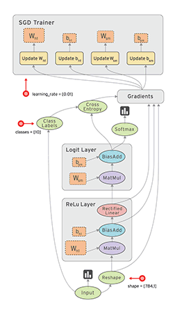
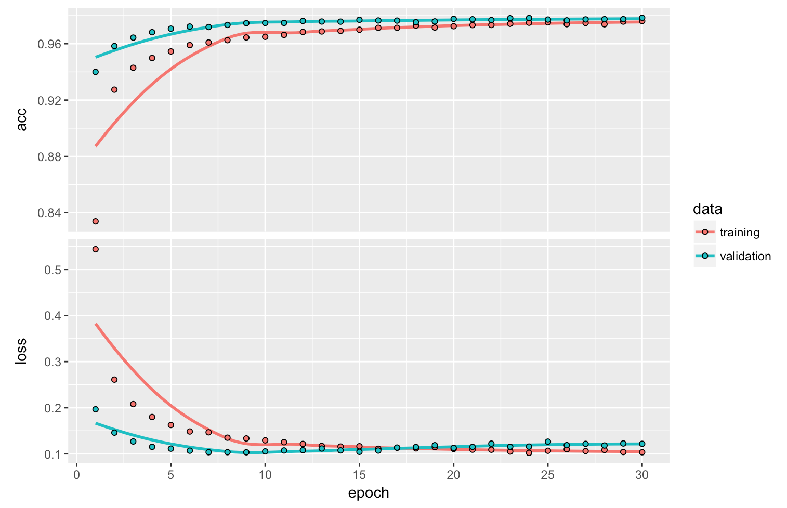

```{r setup, include=FALSE}
knitr::opts_chunk$set(eval = FALSE)
```

<style type="text/css">
.illustration {
  border: solid 1px #cccccc;
</style>


## Overview

- TensorFlow Basics

- R Interfaces to TensorFlow

- Deep Learning

- Supporting Tools 

- Deployment

- Learning More

## What is TensorFlow? | *A general purpose numerical computing library*

- Hardware independent
    - CPU (via C++ library [Eigen](http://eigen.tuxfamily.org/))
    - GPU (via [CUDA](https://en.wikipedia.org/wiki/CUDA))
    - TPU ([Tenor Processing Unit](https://en.wikipedia.org/wiki/Tensor_processing_unit))
    - Others...
    
- Supports distributed execution and very large datasets

- Supports [automatic differentiation](https://en.wikipedia.org/wiki/Automatic_differentiation)

## Why should R users care?

- A new general purpose numerical computing library! 
     - Hardware independent
     - Distributed execution
     - Large datasets
     - Automatic differentiation

- Robust foundation for many deep learning applications

- TensorFlow models can be deployed with a low-latency C++ runtime

- R has a lot to offer as an *interface language* for TensorFlow


## Example: Greta | Writing statistical models and fitting them by MCMC


<https://greta-dev.github.io/greta/>

## Greta Air Model 

```{r}
# Greta
theta = normal(0, 32, dim = 2)
mu <- alpha + beta * Z
X = normal(mu, sigma)
p <- ilogit(theta[1] + theta[2] * X)
distribution(y) = binomial(n, p)
```


```{r}
# BUGS/JAGS
for(j in 1 : J) {
   y[j] ~ dbin(p[j], n[j])
   logit(p[j]) <- theta[1] + theta[2] * X[j]
   X[j] ~ dnorm(mu[j], tau)
   mu[j] <- alpha + beta * Z[j]
}
theta[1] ~ dnorm(0.0, 0.001)
theta[2] ~ dnorm(0.0, 0.001)
```


## What are tensors? | *Data stored in multidimensional arrays*

| Dimension | R object  | 
|---|---|
| 0D | `42` | 
| 1D | `c(42, 42, 42)` 
| 2D | `matrix(42, nrow = 2, ncol = 2)`  |
| 3D | `array(42, dim = c(2,3,2))` |
| 4D | `array(42, dim = c(2,3,2,3))` |

## Some examples

- *Vector data*—2D tensors of shape `(samples, features)`
 
- *Timeseries or sequence data*—3D tensors of shape `(samples, timesteps,
features)`
 
- *Images*—4D tensors of shape `(samples, height, width, channels)`


- *Video*—5D tensors of shape `(samples, frames, height, width, channels)` 


## 2D Tensors | *Vector data*

```{r}
head(data.matrix(iris), n = 10)
```
```
      Sepal.Length Sepal.Width Petal.Length Petal.Width Species
 [1,]          5.1         3.5          1.4         0.2       1
 [2,]          4.9         3.0          1.4         0.2       1
 [3,]          4.7         3.2          1.3         0.2       1
 [4,]          4.6         3.1          1.5         0.2       1
 [5,]          5.0         3.6          1.4         0.2       1
 [6,]          5.4         3.9          1.7         0.4       1
 [7,]          4.6         3.4          1.4         0.3       1
 [8,]          5.0         3.4          1.5         0.2       1
 [9,]          4.4         2.9          1.4         0.2       1
[10,]          4.9         3.1          1.5         0.1       1
```

## 3D Tensors | *Timeseries or sequence data*


## 4D Tensors | *Image data*


## What is tensor "flow"? | A dataflow graph with nodes representing units of computation {.smaller}

<div class="columns-2">
  
 

  - **Parallelism**--System identifies operations that can execute in parallel.
  - **Distributed execution**--Graph can be partitioned accross multiple devices.
  - **Compilation**--Use the information in your dataflow graph to generate faster code (e.g. fusing operations)
  - **Portability**--Dataflow graph is a language-independent representation of the code in your model (deploy with C++ runtime)
</div>


## R Interface to Tensorflow

- High-level R interfaces for neural nets and traditional models

- Low-level interface to allow enable new applications (e.g. Greta)

- Tools to faciliate productive workflow / experiment management

- Easy access to GPUs for training models

- Breadth and depth of educational resources

## TensorFlow APIs | Distinct interfaces for various tasks and levels of abstraction


## R Packages

<div class="columns-2">

### TensorFlow APIs

- [keras](https://tensorflow.rstudio.com/keras/)---Interface for neural networks, with a focus on enabling fast experimentation.
- [tfestimators](https://tensorflow.rstudio.com/tfestimators/)--- Implementations of common model types such as regressors and classifiers. 
- [tensorflow](https://tensorflow.rstudio.com/tensorflow/)---Low-level interface to the TensorFlow computational graph.
- [tfdatasets](https://tensorflow.rstudio.com/tools/tfdatasets/)---Scalable input pipelines for TensorFlow models. 

### Supporting Tools

- [tfruns](https://tensorflow.rstudio.com/tools/tfruns/)---Track, visualize, and manage TensorFlow training runs and experiments.
- [tfdeploy](https://tensorflow.rstudio.com/tools/tfdeploy/)---Tools designed to make exporting and serving TensorFlow models straightforward.
- [cloudml](https://tensorflow.rstudio.com/tools/cloudml/)---R interface to Google Cloud Machine Learning Engine. 

</div>


## 

- High-level neural networks API capable of running on top of [TensorFlow](https://www.tensorflow.org), [CNTK](https://www.microsoft.com/en-us/cognitive-toolkit/), or [Theano](http://www.deeplearning.net/software/theano/) (and soon [MXNet](https://mxnet.apache.org/)).

- Allows for easy and fast prototyping (through user friendliness, modularity, and extensibility).

- Supports both convolutional networks and recurrent networks, as well as combinations of the two.

- Runs seamlessly on CPU and GPU.

- https://keras.rstudio.com

## Keras Adoption

<div class="columns-2">


</div>

## Layers in Neural Networks | A data-processing module that you can think of as a filter for data


## Layers in Neural Networks (cont.) | Layers implement a form of progressive data distillation


## Keras Layers | A grammer for specifying the layers of a neural network

```{r}
model <- keras_model_sequential() %>%
  layer_conv_2d(filters = 32, kernel_size = c(3,3), activation = 'relu',
                input_shape = input_shape) %>% 
  layer_conv_2d(filters = 64, kernel_size = c(3,3), activation = 'relu') %>% 
  layer_max_pooling_2d(pool_size = c(2, 2)) %>% 
  layer_dropout(rate = 0.25) %>% 
  layer_flatten() %>% 
  layer_dense(units = 128, activation = 'relu') %>% 
  layer_dropout(rate = 0.5) %>% 
  layer_dense(units = 10, activation = 'softmax')
```


## Keras: Data Preprocessing 


```{r}
library(keras)

# Load MNIST images datasets (built in to Keras)
c(c(x_train, y_train), c(x_test, y_test)) %<-% dataset_mnist()

# Flatten images and transform RGB values into [0,1] range 
x_train <- array_reshape(x_train, c(nrow(x_train), 784))
x_test <- array_reshape(x_test, c(nrow(x_test), 784))
x_train <- x_train / 255
x_test <- x_test / 255

# Convert class vectors to binary class matrices
y_train <- to_categorical(y_train, 10)
y_test <- to_categorical(y_test, 10)
```

## Keras: Model Definition

```{r}
model <- keras_model_sequential()  %>% 
  layer_dense(units = 256, activation = 'relu', input_shape = c(784)) %>% 
  layer_dropout(rate = 0.4) %>% 
  layer_dense(units = 128, activation = 'relu') %>%
  layer_dropout(rate = 0.3) %>%
  layer_dense(units = 10, activation = 'softmax')

model %>% compile(
  loss = 'categorical_crossentropy',
  optimizer = optimizer_rmsprop(),
  metrics = c('accuracy')
)
```

## Keras: Model Definition (cont.) {.smaller}

```{r}
summary(model)
```
```
_____________________________________________________________________________________
Layer (type)                          Output Shape                      Param #      
=====================================================================================
dense_1 (Dense)                       (None, 256)                       200960       
_____________________________________________________________________________________
dropout_1 (Dropout)                   (None, 256)                       0            
_____________________________________________________________________________________
dense_2 (Dense)                       (None, 128)                       32896        
_____________________________________________________________________________________
dropout_2 (Dropout)                   (None, 128)                       0            
_____________________________________________________________________________________
dense_3 (Dense)                       (None, 10)                        1290         
=====================================================================================
Total params: 235,146
Trainable params: 235,146
Non-trainable params: 0
_____________________________________________________________________________________
```


## Keras: Model Training

```{r}
history <- model %>% fit(
  x_train, y_train,
  batch_size = 128,
  epochs = 30,
  validation_split = 0.2
)
```

```{r}
history
```
```
Trained on 48,000 samples, validated on 12,000 samples (batch_size=128, epochs=30)
Final epoch (plot to see history):
     acc: 0.9057
    loss: 1.5
 val_acc: 0.9317
val_loss: 1.088 
```

## Keras: Model Training (cont.)

```{r}
plot(history)
```


## Keras: Evaluation and Prediction

```{r}
model %>% evaluate(x_test, y_test)
```
```
$loss
[1] 0.1078904

$acc
[1] 0.9815
```

```{r}
model %>% predict_classes(x_test[1:100,])
```
```
  [1] 7 2 1 0 4 1 4 9 5 9 0 6 9 0 1 5 9 7 3 4 9 6 6 5 4 0 7 4 0 1 3 1 3 4 7
 [36] 2 7 1 2 1 1 7 4 2 3 5 1 2 4 4 6 3 5 5 6 0 4 1 9 5 7 8 9 3 7 4 6 4 3 0
 [71] 7 0 2 9 1 7 3 2 9 7 7 6 2 7 8 4 7 3 6 1 3 6 9 3 1 4 1 7 6 9
```


## TensorFlow Estimators | High level API for TensorFlow models <https://tensorflow.rstudio.com/tfestimators/> {.smaller}

| Estimator | Description |
|---|--------------|
| linear_regressor() | Linear regressor model. |
| linear_classifier()	| Linear classifier model. |
| dnn_regressor()	| Dynamic nueral network regression. |
| dnn_classifier() |	Dynamic nueral network classification. |
| dnn_linear_combined_regressor() |	DNN Linear Combined Regression. |
| dnn_linear_combined_classifier() | DNN Linear Combined Classification. |

## TensorFlow Estimators

example


## TensorFlow Core API | Low level access to TensorFlow graph operations <https://tensorflow.rstudio.com/tensorflow/> {.smaller}

```{r}
W <- tf$Variable(tf$random_uniform(shape(1L), -1.0, 1.0))
b <- tf$Variable(tf$zeros(shape(1L)))
y <- W * x_data + b

loss <- tf$reduce_mean((y - y_data) ^ 2)
optimizer <- tf$train$GradientDescentOptimizer(0.5)
train <- optimizer$minimize(loss)

sess = tf$Session()
sess$run(tf$global_variables_initializer())

for (step in 1:200) {
  sess$run(train)
  if (step %% 20 == 0)
    cat(step, "-", sess$run(W), sess$run(b), "\n")
}
```


## Learning more | <https://tensorflow.rstudio.com/learn/>

- Recommended reading

- Keras for R cheatsheet

- Gallery and examples

- Subscribe to the TensorFlow for R blog!


## Recommended Reading

<div class="columns-2" style="margin-top: -38px">

<a style="border-bottom: none;"  href="https://www.amazon.com/Deep-Learning-R-Francois-Chollet/dp/161729554X"></a>

<a style="border-bottom: none;"  href="https://www.amazon.com/Deep-Learning-Adaptive-Computation-Machine/dp/0262035618/"></a>

</div>


## Keras for R cheatsheet | <https://github.com/rstudio/cheatsheets/raw/master/keras.pdf>

<a style="border-bottom: none;" href="https://github.com/rstudio/cheatsheets/raw/master/keras.pdf"></a>

## Gallery and examples | <https://tensorflow.rstudio.com/learn/gallery.html>

<a style="border-bottom: none;" href="https://tensorflow.rstudio.com/learn/gallery.html"></a>

## Thank you!

  


TensorFlow for R: <https://tensorflow.rstudio.com>

Stay up to date at: <https://tensorflow.rstudio.com/blog/>

**Questions?**


## In Place Modification | Object semantics are not by-value! (as is conventional in R)

```{r}
# Modify model object in place (note that it is not assigned back to)
model %>% compile(
  optimizer = 'rmsprop',
  loss = 'binary_crossentropy',
  metrics = c('accuracy')
)
```

- Keras models are directed acyclic graphs of layers whose state is updated during training.

- Keras layers can be shared by mutliple parts of a Keras model.


