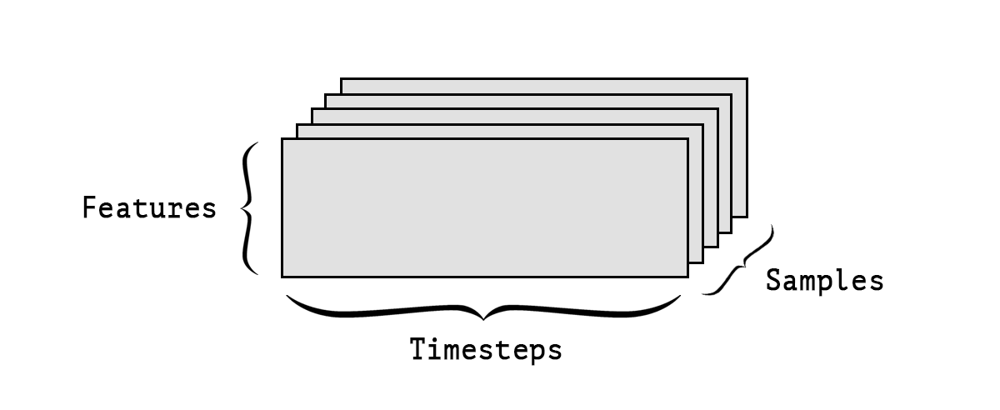
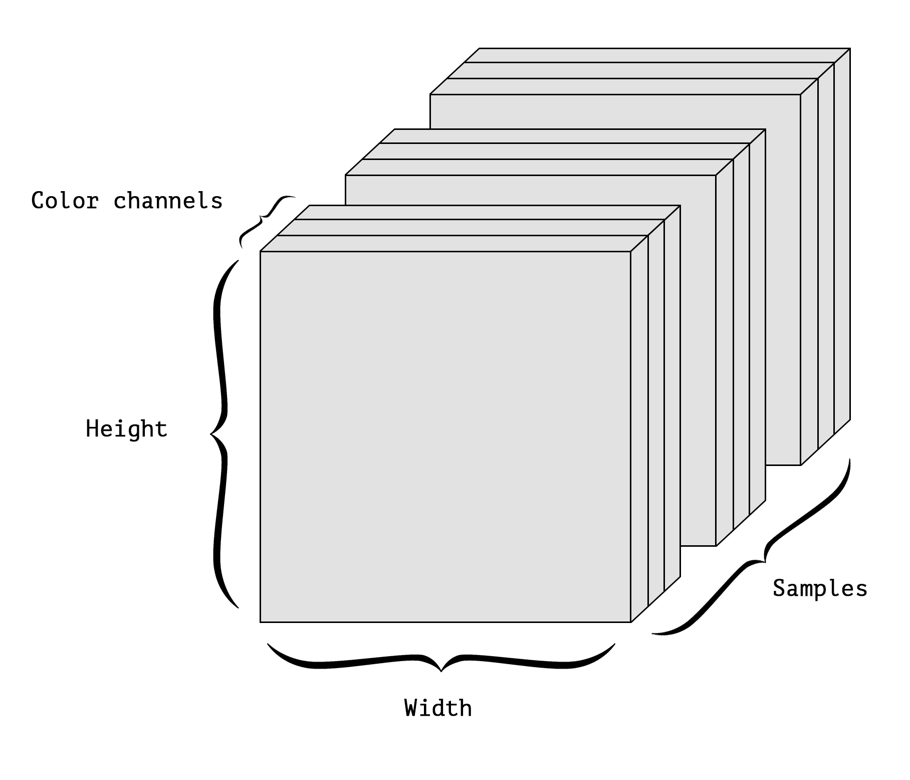

```{r setup, include=FALSE}
knitr::opts_chunk$set(eval = FALSE)
```

<style type="text/css">
.illustration {
  border: solid 1px #cccccc;
</style>


## Overview

- TensorFlow Basics

- R Interfaces to TensorFlow

- Deep Learning

- Supporting Tools 

- Deployment

- Learning More

## What is TensorFlow? | *A general purpose numerical computing library*

- Hardware independent
    - CPU (via C++ library [Eigen](http://eigen.tuxfamily.org/))
    - GPU (via [CUDA](https://en.wikipedia.org/wiki/CUDA))
    - TPU ([Tenor Processing Unit](https://en.wikipedia.org/wiki/Tensor_processing_unit))
    - Others...
    
- Supports distributed execution and very large datasets

- Supports [automatic differentiation](https://en.wikipedia.org/wiki/Automatic_differentiation)

## Why should R users care?

- A new general purpose numerical computing library! 
     - Hardware independent
     - Distributed execution
     - Large datasets
     - Automatic differentiation

- Robust foundation for many deep learning applications

- TensorFlow models can be deployed with a low-latency C++ runtime

- R has a lot to offer as an *interface language* for TensorFlow


## Example: Greta | Writing statistical models and fitting them by MCMC


<https://greta-dev.github.io/greta/>

## Greta Air Model 

```{r}
# Greta
theta = normal(0, 32, dim = 2)
mu <- alpha + beta * Z
X = normal(mu, sigma)
p <- ilogit(theta[1] + theta[2] * X)
distribution(y) = binomial(n, p)
```


```{r}
# BUGS/JAGS
for(j in 1 : J) {
   y[j] ~ dbin(p[j], n[j])
   logit(p[j]) <- theta[1] + theta[2] * X[j]
   X[j] ~ dnorm(mu[j], tau)
   mu[j] <- alpha + beta * Z[j]
}
theta[1] ~ dnorm(0.0, 0.001)
theta[2] ~ dnorm(0.0, 0.001)
```


## What are tensors? | *Data stored in multidimensional arrays*

| Dimension | R object  | 
|---|---|
| 0D | `42` | 
| 1D | `c(42, 42, 42)` 
| 2D | `matrix(42, nrow = 2, ncol = 2)`  |
| 3D | `array(42, dim = c(2,3,2))` |
| 4D | `array(42, dim = c(2,3,2,3))` |

## Some examples

- *Vector data*—2D tensors of shape `(samples, features)`
 
- *Timeseries or sequence data*—3D tensors of shape `(samples, timesteps,
features)`
 
- *Images*—4D tensors of shape `(samples, height, width, channels)`


- *Video*—5D tensors of shape `(samples, frames, height, width, channels)` 


## 2D Tensors | *Vector data*

```{r}
head(data.matrix(iris), n = 10)
```
```
      Sepal.Length Sepal.Width Petal.Length Petal.Width Species
 [1,]          5.1         3.5          1.4         0.2       1
 [2,]          4.9         3.0          1.4         0.2       1
 [3,]          4.7         3.2          1.3         0.2       1
 [4,]          4.6         3.1          1.5         0.2       1
 [5,]          5.0         3.6          1.4         0.2       1
 [6,]          5.4         3.9          1.7         0.4       1
 [7,]          4.6         3.4          1.4         0.3       1
 [8,]          5.0         3.4          1.5         0.2       1
 [9,]          4.4         2.9          1.4         0.2       1
[10,]          4.9         3.1          1.5         0.1       1
```

## 3D Tensors | *Timeseries or sequence data*




## 4D Tensors | *Image data*




## What is tensor "flow"? | A dataflow graph with nodes representing units of computation {.smaller}

<div class="columns-2">
  
 

  - **Parallelism**--System identifies operations that can execute in parallel.
  - **Distributed execution**--Graph can be partitioned accross multiple devices.
  - **Compilation**--Use the information in your dataflow graph to generate faster code (e.g. fusing operations)
  - **Portability**--Dataflow graph is a language-independent representation of the code in your model (deploy with C++ runtime)
</div>


## R Interface to Tensorflow

- High-level R interfaces for neural nets and traditional models

- Low-level interface to allow enable new applications (e.g. Greta)

- Tools to faciliate productive workflow / experiment management

- Easy access to GPUs for training models

- Breadth and depth of educational resources

## TensorFlow APIs | Distinct interfaces for various tasks and levels of abstraction


## R Packages

<div class="columns-2">

### TensorFlow APIs

- [keras](https://tensorflow.rstudio.com/keras/)---Interface for neural networks, with a focus on enabling fast experimentation.
- [tfestimators](https://tensorflow.rstudio.com/tfestimators/)--- Implementations of common model types such as regressors and classifiers. 
- [tensorflow](https://tensorflow.rstudio.com/tensorflow/)---Low-level interface to the TensorFlow computational graph.
- [tfdatasets](https://tensorflow.rstudio.com/tools/tfdatasets/)---Scalable input pipelines for TensorFlow models. 

### Supporting Tools

- [tfruns](https://tensorflow.rstudio.com/tools/tfruns/)---Track, visualize, and manage TensorFlow training runs and experiments.
- [tfdeploy](https://tensorflow.rstudio.com/tools/tfdeploy/)---Tools designed to make exporting and serving TensorFlow models straightforward.
- [cloudml](https://tensorflow.rstudio.com/tools/cloudml/)---R interface to Google Cloud Machine Learning Engine. 

</div>


## 

- High-level neural networks API capable of running on top of [TensorFlow](https://www.tensorflow.org), [CNTK](https://www.microsoft.com/en-us/cognitive-toolkit/), or [Theano](http://www.deeplearning.net/software/theano/) (and soon [MXNet](https://mxnet.apache.org/)).

- Allows for easy and fast prototyping (through user friendliness, modularity, and extensibility).

- Supports both convolutional networks and recurrent networks, as well as combinations of the two.

- Runs seamlessly on CPU and GPU.

- https://keras.rstudio.com

## Keras Adoption

<div class="columns-2">


</div>

## Layers in Neural Networks | A data-processing module that you can think of as a filter for data


## Layers in Neural Networks (cont.) | Layers implement a form of progressive data distillation


## Keras Layers | A grammer for specifying the layers of a neural network

```{r}
model <- keras_model_sequential() %>%
  layer_conv_2d(filters = 32, kernel_size = c(3,3), activation = 'relu',
                input_shape = input_shape) %>% 
  layer_conv_2d(filters = 64, kernel_size = c(3,3), activation = 'relu') %>% 
  layer_max_pooling_2d(pool_size = c(2, 2)) %>% 
  layer_dropout(rate = 0.25) %>% 
  layer_flatten() %>% 
  layer_dense(units = 128, activation = 'relu') %>% 
  layer_dropout(rate = 0.5) %>% 
  layer_dense(units = 10, activation = 'softmax')
```


## Keras: Data Preprocessing 


```{r}
library(keras)

# Load MNIST images datasets (built in to Keras)
c(c(x_train, y_train), c(x_test, y_test)) %<-% dataset_mnist()

# Flatten images and transform RGB values into [0,1] range 
x_train <- array_reshape(x_train, c(nrow(x_train), 784))
x_test <- array_reshape(x_test, c(nrow(x_test), 784))
x_train <- x_train / 255
x_test <- x_test / 255

# Convert class vectors to binary class matrices
y_train <- to_categorical(y_train, 10)
y_test <- to_categorical(y_test, 10)
```

## Keras: Model Definition

```{r}
model <- keras_model_sequential()  %>% 
  layer_dense(units = 256, activation = 'relu', input_shape = c(784)) %>% 
  layer_dropout(rate = 0.4) %>% 
  layer_dense(units = 128, activation = 'relu') %>%
  layer_dropout(rate = 0.3) %>%
  layer_dense(units = 10, activation = 'softmax')

model %>% compile(
  loss = 'categorical_crossentropy',
  optimizer = optimizer_rmsprop(),
  metrics = c('accuracy')
)
```

## Keras: Model Definition (cont.) {.smaller}

```{r}
summary(model)
```
```
_____________________________________________________________________________________
Layer (type)                          Output Shape                      Param #      
=====================================================================================
dense_1 (Dense)                       (None, 256)                       200960       
_____________________________________________________________________________________
dropout_1 (Dropout)                   (None, 256)                       0            
_____________________________________________________________________________________
dense_2 (Dense)                       (None, 128)                       32896        
_____________________________________________________________________________________
dropout_2 (Dropout)                   (None, 128)                       0            
_____________________________________________________________________________________
dense_3 (Dense)                       (None, 10)                        1290         
=====================================================================================
Total params: 235,146
Trainable params: 235,146
Non-trainable params: 0
_____________________________________________________________________________________
```


## Keras: Model Training

```{r}
history <- model %>% fit(
  x_train, y_train,
  batch_size = 128,
  epochs = 30,
  validation_split = 0.2
)
```

```{r}
history
```
```
Trained on 48,000 samples, validated on 12,000 samples (batch_size=128, epochs=30)
Final epoch (plot to see history):
     acc: 0.9057
    loss: 1.5
 val_acc: 0.9317
val_loss: 1.088 
```

## Keras: Model Training (cont.)

```{r}
plot(history)
```


## Keras: Evaluation and Prediction

```{r}
model %>% evaluate(x_test, y_test)
```
```
$loss
[1] 0.1078904

$acc
[1] 0.9815
```

```{r}
model %>% predict_classes(x_test[1:100,])
```
```
  [1] 7 2 1 0 4 1 4 9 5 9 0 6 9 0 1 5 9 7 3 4 9 6 6 5 4 0 7 4 0 1 3 1 3 4 7
 [36] 2 7 1 2 1 1 7 4 2 3 5 1 2 4 4 6 3 5 5 6 0 4 1 9 5 7 8 9 3 7 4 6 4 3 0
 [71] 7 0 2 9 1 7 3 2 9 7 7 6 2 7 8 4 7 3 6 1 3 6 9 3 1 4 1 7 6 9
```

## TensorFlow Estimators | High level API for TensorFlow models <https://tensorflow.rstudio.com/tfestimators/> {.smaller}

| Estimator | Description |
|---|--------------|
| linear_regressor() | Linear regressor model. |
| linear_classifier()	| Linear classifier model. |
| dnn_regressor()	| Dynamic nueral network regression. |
| dnn_classifier() |	Dynamic nueral network classification. |
| dnn_linear_combined_regressor() |	DNN Linear Combined Regression. |
| dnn_linear_combined_classifier() | DNN Linear Combined Classification. |

## TensorFlow Core API | Low level access to TensorFlow graph operations <https://tensorflow.rstudio.com/tensorflow/> {.smaller}

```{r}
W <- tf$Variable(tf$random_uniform(shape(1L), -1.0, 1.0))
b <- tf$Variable(tf$zeros(shape(1L)))
y <- W * x_data + b

loss <- tf$reduce_mean((y - y_data) ^ 2)
optimizer <- tf$train$GradientDescentOptimizer(0.5)
train <- optimizer$minimize(loss)

sess = tf$Session()
sess$run(tf$global_variables_initializer())

for (step in 1:200) {
  sess$run(train)
  if (step %% 20 == 0)
    cat(step, "-", sess$run(W), sess$run(b), "\n")
}
```


## Deep Learning

TODO: Deep learning section

## Supporting Tools

- [tfruns](https://tensorflow.rstudio.com/tools/tfruns/) package

- [cloudml](https://tensorflow.rstudio.com/tools/cloudml/) package

- [tfdeploy](https://tensorflow.rstudio.com/tools/tfdeploy/) package


## tfruns package | <https://tensorflow.rstudio.com/tools/tfruns/>

- Successful deep learning requires a huge amount of experimentation

- This requires a systematic approach to conducting and tracking the results of experiements


The `training_run()` function is like the `source()` function, but it automatically tracks and records output and metadata for the execution of the script:

```{r}
library(tfruns)
training_run("mnist_mlp.R")
```

## tfruns::ls_runs() {.smaller}

```{r}
ls_runs()
```
```
Data frame: 4 x 28 
                    run_dir eval_loss eval_acc metric_loss metric_acc metric_val_loss metric_val_acc
1 runs/2017-12-09T21-01-11Z    0.1485   0.9562      0.2577     0.9240          0.1482         0.9545
2 runs/2017-12-09T21-00-11Z    0.1438   0.9573      0.2655     0.9208          0.1505         0.9559
3 runs/2017-12-09T19-59-44Z    0.1407   0.9580      0.2597     0.9241          0.1402         0.9578
4 runs/2017-12-09T19-56-48Z    0.1437   0.9555      0.2610     0.9227          0.1459         0.9551
```

```{r}
ls_runs(eval_acc > 0.9570, order = eval_acc)
```
```
Data frame: 2 x 28 
                    run_dir eval_acc eval_loss metric_loss metric_acc metric_val_loss metric_val_acc
1 runs/2017-12-09T19-59-44Z   0.9580    0.1407      0.2597     0.9241          0.1402         0.9578
2 runs/2017-12-09T21-00-11Z   0.9573    0.1438      0.2655     0.9208          0.1505         0.9559
```
## tfruns::view_run()


## tfruns::compare_runs()


## tfruns::flags()

```{r}
# define flags and their defaults
FLAGS <- flags(
  flag_integer("dense_units1", 128),
  flag_numeric("dropout1", 0.4),
  flag_integer("dense_units2", 128),
  flag_numeric("dropout2", 0.3)
)
```

```{r}
# use flag 
layer_dropout(rate = FLAGS$dropout1)
```

```{r}
# train with flag
training_run("mnist_mlp.R", flags = list(dropout1 = 0.3))
```

## tfruns::tuning_run() {.smaller}

```{r}
# run various combinations of dropout1 and dropout2
runs <- tuning_run("mnist_mlp.R", flags = list(
  dropout1 = c(0.2, 0.3, 0.4),
  dropout2 = c(0.2, 0.3, 0.4)
))
```

```{r}
# find the best evaluation accuracy
runs[order(runs$eval_acc, decreasing = TRUE), ]
```
```
Data frame: 9 x 28 
                    run_dir eval_loss eval_acc metric_loss metric_acc metric_val_loss metric_val_acc
9 runs/2018-01-26T13-21-03Z    0.1002   0.9817      0.0346     0.9900          0.1086         0.9794
6 runs/2018-01-26T13-23-26Z    0.1133   0.9799      0.0409     0.9880          0.1236         0.9778
5 runs/2018-01-26T13-24-11Z    0.1056   0.9796      0.0613     0.9826          0.1119         0.9777
4 runs/2018-01-26T13-24-57Z    0.1098   0.9788      0.0868     0.9770          0.1071         0.9771
2 runs/2018-01-26T13-26-28Z    0.1185   0.9783      0.0688     0.9819          0.1150         0.9783
3 runs/2018-01-26T13-25-43Z    0.1238   0.9782      0.0431     0.9883          0.1246         0.9779
8 runs/2018-01-26T13-21-53Z    0.1064   0.9781      0.0539     0.9843          0.1086         0.9795
7 runs/2018-01-26T13-22-40Z    0.1043   0.9778      0.0796     0.9772          0.1094         0.9777
1 runs/2018-01-26T13-27-14Z    0.1330   0.9769      0.0957     0.9744          0.1304         0.9751
```

## cloudml package | <https://tensorflow.rstudio.com/tools/cloudml/> {.smaller}

<div class="columns-2" style="margin-top: -10px;">


<br/>

- Scalable training of models built with the keras, tfestimators, and tensorflow R packages.

- On-demand access to training on GPUs, including the new Tesla P100 GPUs from NVIDIA®.

- Hyperparameter tuning to optmize key attributes of model architectures in order to maximize predictive accuracy.


</div>

## cloudml::cloudml_train() 

Train on default CPU instance:

```{r}
library(cloudml)
cloudml_train("mnist_mlp.R")
```

- Automatically uploads contents of working directory along with script

- Automatically installs all required R packages on CloudML servers


```{r}
# Train on a GPU instance
cloudml_train("mnist_mlp.R", master_type = "standard_gpu")

# Train on an NVIDIA Tesla P100 GPU
cloudml_train("mnist_mlp.R", master_type = "standard_p100")
```


## cloudml::job_collect()

```{r}
job_collect()
```

<div class="columns-2">


- Collects job metadata and all files created by the job (e.g. event logs, saved models)

- Uses tfruns to allow inspection, enumeration, and comparision of jobs

</div>

## cloudml: ls_runs() {.smaller}

```{r}
ls_runs()
```
```
Data frame: 6 x 37 
                            run_dir eval_loss eval_acc metric_loss metric_acc metric_val_loss metric_val_acc
6 runs/cloudml_2018_01_26_135812740    0.1049   0.9789      0.0852     0.9760          0.1093         0.9770
2 runs/cloudml_2018_01_26_140015601    0.1402   0.9664      0.1708     0.9517          0.1379         0.9687
5 runs/cloudml_2018_01_26_135848817    0.1159   0.9793      0.0378     0.9887          0.1130         0.9792
3 runs/cloudml_2018_01_26_135936130    0.0963   0.9780      0.0701     0.9792          0.0969         0.9790
1 runs/cloudml_2018_01_26_140045584    0.1486   0.9682      0.1860     0.9504          0.1453         0.9693
4 runs/cloudml_2018_01_26_135912819    0.1141   0.9759      0.1272     0.9655          0.1087         0.9762
# ... with 30 more columns:
#   flag_dense_units1, flag_dropout1, flag_dense_units2, flag_dropout2, samples, validation_samples,
#   batch_size, epochs, epochs_completed, metrics, model, loss_function, optimizer, learning_rate,
#   script, start, end, completed, output, source_code, context, type, cloudml_console_url,
#   cloudml_created, cloudml_end, cloudml_job, cloudml_log_url, cloudml_ml_units, cloudml_start,
#   cloudml_state
```

## CloudML Hyperparameter Tuning | Start by using FLAGS in your training script

<div style="margin-top: -38px;">
```{r}
FLAGS <- flags(
  flag_integer("dense_units1", 128),
  flag_numeric("dropout1", 0.4),
  flag_integer("dense_units2", 128),
  flag_numeric("dropout2", 0.3)
)

model <- keras_model_sequential() %>% 
  layer_dense(units = FLAGS$dense_units1, activation = 'relu', 
              input_shape = c(784)) %>%
  layer_dropout(rate = FLAGS$dropout1) %>%
  layer_dense(units = FLAGS$dense_units2, activation = 'relu') %>%
  layer_dropout(rate = FLAGS$dropout2) %>%
  layer_dense(units = 10, activation = 'softmax')
```
</div>

## CloudML Hyperparameter Tuning (cont.) | Create a tuning configuration file (tuning.yml)

<div style="margin-top: -38px;">
```yaml
trainingInput:
  hyperparameters:
    goal: MAXIMIZE
    hyperparameterMetricTag: acc
    maxTrials: 10
    params:
      - parameterName: dropout1
        type: DOUBLE
        minValue: 0.2
        maxValue: 0.6
        scaleType: UNIT_LINEAR_SCALE
      - parameterName: dropout2
        type: DOUBLE
        minValue: 0.1
        maxValue: 0.5
        scaleType: UNIT_LINEAR_SCALE
```
</div>

## CloudML Hyperparameter Tuning (cont.) | Run the tuning job and inspect trials{.smaller}

<div style="margin-top: -38px;">
```{r}
cloudml_train("minst_mlp.R", config = "tuning.yml")
```

```{r}
job_trials()
```
```
finalMetric.objectiveValue finalMetric.trainingStep hyperparameters.dropout1 hyperparameters.dropout2 trialId
1                    0.973854                       19       0.2011326172916916      0.32774705750441724      10
2                    0.973458                       19      0.20090378506439671      0.10079321757280404       3
3                    0.973354                       19       0.5476299090261757      0.49998941144858033       6
4                    0.972875                       19        0.597820322273044       0.4074512354566201       7
5                    0.972729                       19      0.25969787952729828      0.42851076497180118       1
6                    0.972417                       19      0.20045494784980847      0.15927383711937335       4
7                    0.972188                       19      0.33367593781223304      0.10077055587860367       5
8                    0.972188                       19      0.59880072314674071      0.10476853415572558       9
9                    0.972021                       19         0.40078175292512      0.49982245025905447       8
10          
```
</div>

## CloudML Hyperparameter Tuning (cont.) | Collect the best performing trial

<div style="margin-top: -38px;">
```{r}
job_collect(trials = "best")
```

<div class="columns-2">


- Collects trial with best objective metric by default

- Specify `trials = "all"` to collect all trials (runs) and then perform offline anaysis of hyperparameter interactions via `ls_runs()`.

</div>
</div>

## CloudML: Additional Talk and Contest

- Talk by Google

## tfdeploy package | <https://tensorflow.rstudio.com/tools/tfdeploy/>

- TensorFlow was built from the ground up to enable deployment using a low-latency C++ runtime.

- Deploying TensorFlow models requires no runtime R or Python code.

- Key enabler for this is the TensorFlow [SavedModel](https://github.com/tensorflow/tensorflow/blob/master/tensorflow/python/saved_model/README.md format):

    *SavedModel provides a language-neutral format to save machine-learned models that is recoverable and hermetic. It enables higher-level systems and tools to produce, consume and transform TensorFlow models.*

- TensorFlow models can be deployed to servers, embedded devices, mobile phones, and even to a web browser!

## Deployment: Exporting a SavedModel

```{r}
model <- keras_model_sequential( %>% )
  layer_dense(units = 256, activation = 'relu', input_shape = c(784),
### <b>
              name = "image") %>%
### </b>
  layer_dense(units = 128, activation = 'relu') %>%
  layer_dense(units = 10, activation = 'softmax',
### <b>
              name = "prediction")
### </b>
```

Note that we give the input and output layers names ("image" and "prediction")

```{r}
# ...compile and fit model

# export model
library(tfdeploy)
export_savedmodel(model, "minst-model")
```

## Deployment: serve_savedmodel() | Provide a local HTTP REST interface to the model from R

<div style="margin-top: -38px;">
```{r}
serve_savedmodel("mnist-model")
```


</div>

## Deployment: TensorFlow Serving | <https://www.tensorflow.org/serving/>


## Deployment: RStudio Connect

## Deployment: CloudML

## Deployment: Mobile and Browser

- Additional talk by Javier

## Deployment: Shiny


## Learning more | <https://tensorflow.rstudio.com/learn/>

- Recommended reading

- Keras for R cheatsheet

- Gallery and examples

- Subscribe to the TensorFlow for R blog!


## Recommended Reading

<div class="columns-2" style="margin-top: -38px">

<a style="border-bottom: none;"  href="https://www.amazon.com/Deep-Learning-R-Francois-Chollet/dp/161729554X"></a>

<a style="border-bottom: none;"  href="https://www.amazon.com/Deep-Learning-Adaptive-Computation-Machine/dp/0262035618/"></a>

</div>


## Keras for R cheatsheet | <https://github.com/rstudio/cheatsheets/raw/master/keras.pdf>

<a style="border-bottom: none;" href="https://github.com/rstudio/cheatsheets/raw/master/keras.pdf"></a>

## Gallery and examples | <https://tensorflow.rstudio.com/learn/gallery.html>

<a style="border-bottom: none;" href="https://tensorflow.rstudio.com/learn/gallery.html"></a>

## Thank you!

  

<br/>

Slides: <https://beta.rstudioconnect.com/ml-with-tensorflow-and-r/>

<br/>

TensorFlow for R: <https://tensorflow.rstudio.com>

<br/>

Stay up to date at: <https://tensorflow.rstudio.com/blog/>


## In Place Modification | Object semantics are not by-value! (as is conventional in R)

```{r}
# Modify model object in place (note that it is not assigned back to)
model %>% compile(
  optimizer = 'rmsprop',
  loss = 'binary_crossentropy',
  metrics = c('accuracy')
)
```

- Keras models are directed acyclic graphs of layers whose state is updated during training.

- Keras layers can be shared by mutliple parts of a Keras model.


